# Урок 01. Основные термины

Изначально «тактика» обозначало «искусство расположения и построения войск».
Это понятие зародилось с появлением первых армий. А её дальнейшее развитие связано не только с совершенствованием оружия, но и с лучшей подготовкой личного состава войск. 
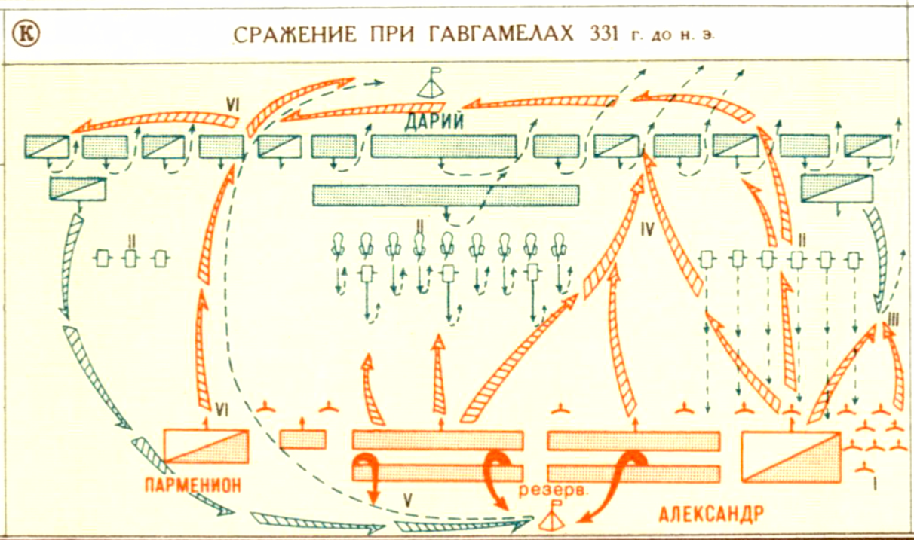

В современном военном искусстве это уже более сложное понятие.  
**Тактика** — это учение о бое и означает умение эффективно распоряжаться имеющимися силами и средствами (силы - это люди, а средства - это вооружение и техника).

Тактика включает в себя как теорию, так практику подготовки и ведения боя.  
Основные задачи современной тактики:
* разработка способов подготовки и ведения боя;
* поиск наиболее эффективных способов применения средств поражения и защиты;
* определение боевых возможностей своих подразделений,
* постановка задач подразделениям и поределение методов организации взаимодействия между подразделениями;
* изучение роли огня, ударов и маневров в бою;
* изучение сил и средств противника и его приёмов ведения боя.

## Тактические действия
**Тактические действия** – спланированные действия одного или нескольких подразделений при выполнении поставленных задач.
Они различаются по **формам**, **видам** и **способам**.

Существуют **три формы** тактических действий, это: **бой**, **удар**, **манёвр**. 
**Виды тактических действий**: оборона, наступление, передвижение войск, расположение на месте (в районе). 
**Способ тактических действий** – избранный вариант, порядок и последовательность применения сил и средств при выполнении поставленных задач.

## Формы тактических действий
**Бой** - основная форма тактических действий.  
Это организованные и согласованные действия для уничтожения или захвата противника, отражения его ударов или выполнения других задач.  
Современный бой сухопутных войск является общевойсковым. А Общевойсковой бой ведется объединенными усилиями всех родов войск, те с применением танков, артиллерии, ПВО, авиации и тд.

 

**Удар** – одновременное поражение группировок войск и объектов противника путем мощного воздействия на них имеющимися средствами поражения или наступлением войск (удар войсками).
В большинстве случаев, данный термин используется для чего-то массового, например, удар танковыми войсками или ядерный удар.  
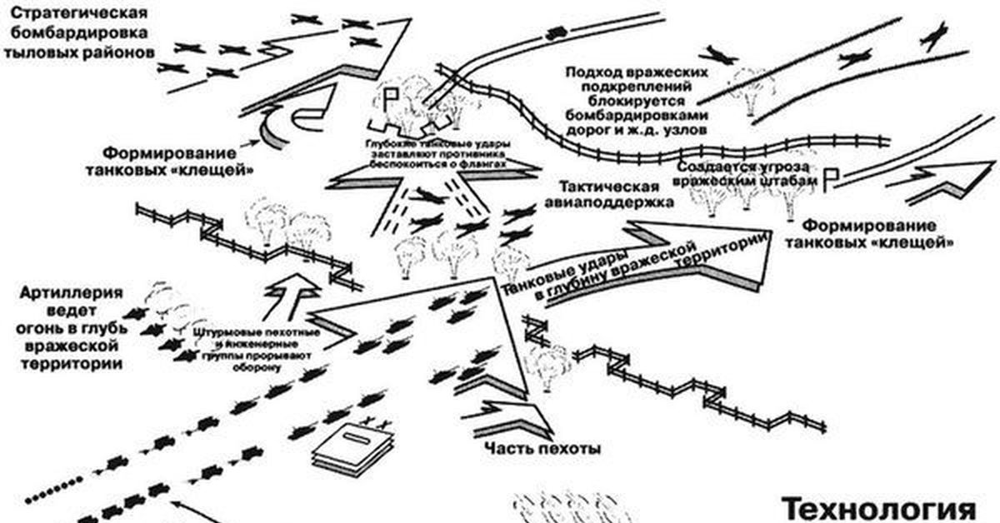

 

**Манёвр** – организованное передвижение подразделений, чтобы занять выгодное положения для ведения огня по наиболее уязвимому месту противника.  
Например, во фланг или в тыл. 
Ещё манёвр используется для вывода подразделений из-под удара противника.

Видами маневра являются: **обход, охват, отход или смена позиций.**
* **Обход** – глубокий манёвр для выхода в тыл противника и нанесение удара.
* **Охват** – манёвр, осуществляемый для выхода во фланг противника.

**Охват** и **обход** осуществляются, в большинстве случаев, при тесном взаимодействии с соседними подразделениями.

* **Отход или смена позиций** это манёвр для вывода подразделения из-под ударов превосходящего противника или при угрозе окружения.
  Так же этот манёвр используется для занятия более выгодного положения при последующих действий.

| 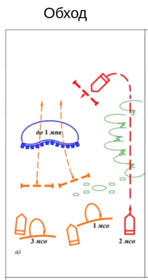| 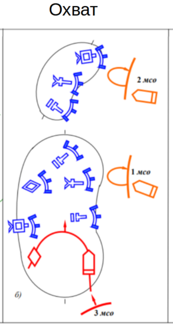 | 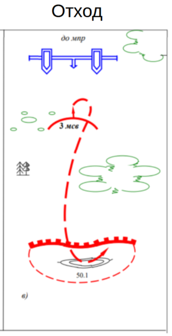 |
|------------------------|-------------------------|-------------------------|

 

**Огонь** - основное средство уничтожения противника в бою, фактически, это стрельба из различных видов оружия для поражения противника.  
Видов видения огня очень много. Например, огонь разделяют по направлению стрельбы: **фронтальный, перекрестный и фланговый**.  
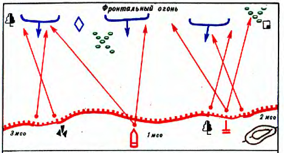  
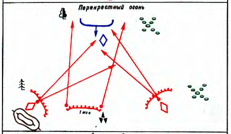  
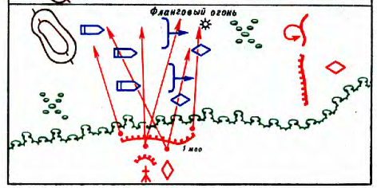  
Или бывает **Кинжальный огонь** - это огонь из пулеметов и автоматов, открываемый внезапно с близких расстояний в одном направлении.
Более детально об этом позже.

 

**Манёвр огнём** применяется для более эффективного поражения противника.  
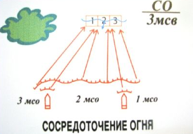
**Сосредоточение огня** - используется для ведения огня несколькими огневыми средствами, например, БМП, или целыми подразделениями одновременно по одной важной цели. 

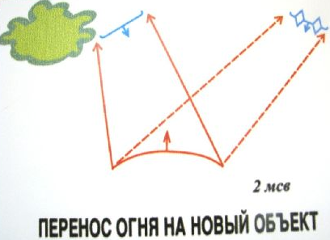
**Перенос огня** - это прекращение огня по одной цели и открытия огня по другой без смены огневых позиций. 

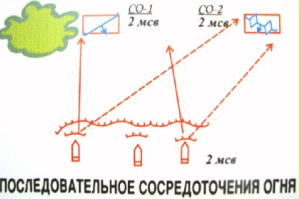
**Последовательное сосредоточение огня** - это сосредоточенный огонь по противнику, находящимуся на одном рубеже и в дальнейшем последовательный перенос огня с рубежа на рубеж по мере продвижения противника. 

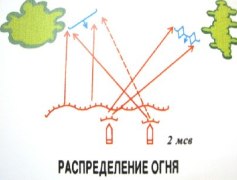
**Распределение огня** - используется для ведения огня каждым подразделением или огневым средством по своей цели.

## Виды тактических действий
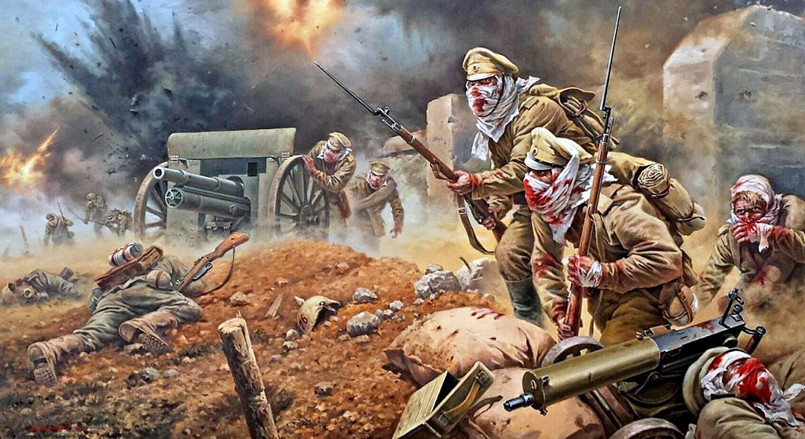 
Основными видами общевойскового боя являются **наступательный** и **оборонительный бой**. Или просто: **оборона** и **наступление**
* **Наступление** – основной вид боевых действий, проводимый в целях разгрома противника и захвата назначенных объектов.  
  Разновидность наступательного боя – **встречный бой**.
* **Оборона** – вид боевых действий, который имеет целью отразить наступление противника, нанести ему максимальные потери и удержать опорный пункт. 
  Разновидности оборонительного боя: **бой в окружении** и **выход из боя (окружения)**.

## Структура мотострелкового взвода и отделения

**Структура мотострелкового взвода**
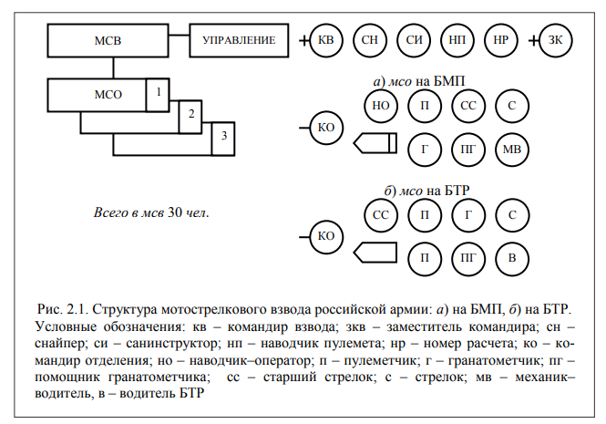

**Мотострелковое отделение на БМП включает следующий личный состав:**
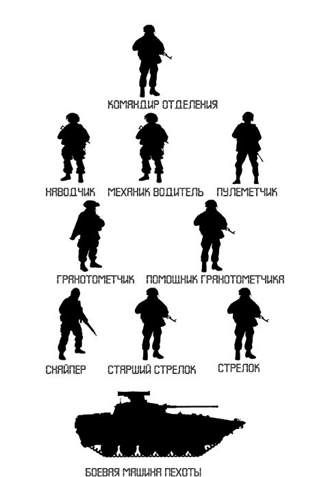
* Командир отделения он же командир БМП (вооружен АК 74);
* Наводчик, он же заместитель Командира боевой машины (вооружен АКСУ);
* Механик водитель (вооружен АКСУ);
* Пулеметчик (вооружен ПКМ);
* Гранатометчик (вооружен РПГ 7в);
* Помощник гранатометчика (вооружен АК 74);
* Снайпер (вооружен СВД);
* Старший стрелок (вооружен АК 74);
* Стрелок (вооружен АК 74).

**Мотострелковое отделение на БТР включает следующий личный состав:**
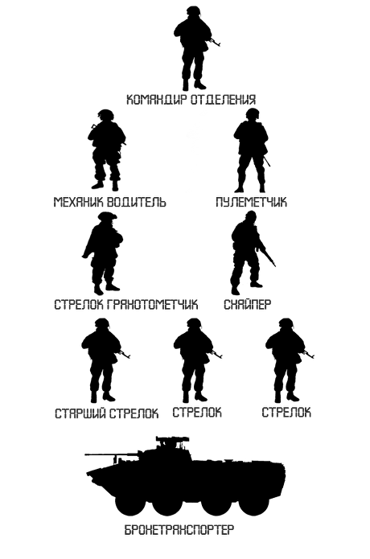
* Командир отделения (АК 74);
* Механик водитель (АКСУ)
* Пулеметчик (ПКМ);
* Стрелок гранатометчик (РПГ 7в);
* Снайпер (СВД),
* Старший стрелок (АК 74),
* Стрелок (АК 74).
* Стрелок (АК 74).

## Способы тактических действий
Выбор способа тактических действий зависит от полученной задачи, состава применяемого оружия, характера действий, боевых возможностей подразделений  своих и противника, района предстоящих действий, времени года, суток и состояния погоды, радиоэлектронной, радиационной, химической и биологической обстановки.

На картинке ниже представлен пример Боевого порядка мотострелкового отделения в наступлении.
Боевой порядок отделения обычно строиться на основе боевых групп: **маневренной** и **огневой**.
Состав групп определяет командир на основе поставленной задачи и условий обстановки.
Кроме того, в боевой порядок отделения может входить **боевая машина**.
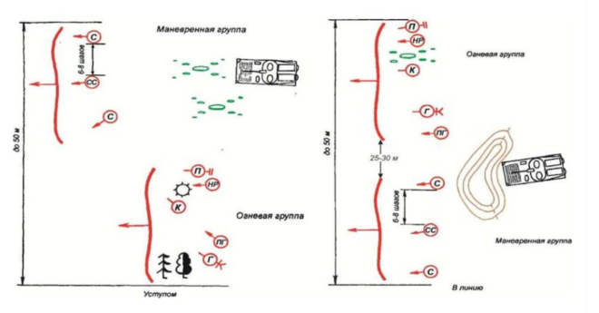

**Маневренная группа** предназначена для выполнения задач по уничтожению противника и захвату его объектов, и в дальнейшем прочному удержанию занимаемых позиций.
В состав маневренной группы, как правило, назначаются старший стрелок и один или два стрелка.

**Огневая группа** предназначена для поддержки действий маневренной группы и выполнения вместе с ней боевых задач.
В состав огневой группы, как правило, входят: командир отделения, гранатометчик, стрелок-помощник гранатометчика и пулеметчик.

**Боевая машина** предназначена для поддержки огнем действий боевых групп, а также для перевозки личного состава.

Существенную роль успеха в бою играет умелое построение **походного**, **предбоевого** и **боевого порядка**.
Понятно, что Бой может происходить в любых построениях. Другое дело, что наиболее эффективным для этого является боевой порядок.
Именно поэтому, походный и предбоевой порядки должны строиться с учетом быстрого перестроения тактической группы в боевой порядок.

**Походный порядок** – построение подразделений для движения на марше, при преследовании противника и проведении маневра. 
**Предбоевой порядок** – построение подразделений по фронту и в глубину на установленные интервалы и дистанции. 
**Боевой порядок** – построение подразделений для ведения боя.

Какой боевой порядок использовать командир определяет в зависимости от полученных задач, замысла предстоящего боя, действий противника, наличия сил и средств в подразделениях и характера местности.

## Примеры схем
**Боевой порядок МСО в обороне**
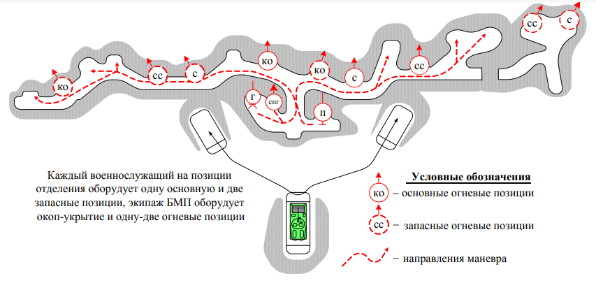

**Боевой порядок Взвода в обороне**
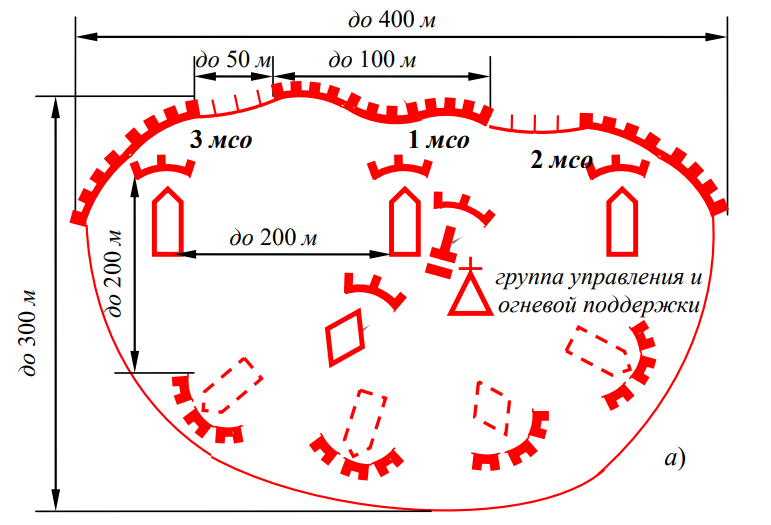

**Боевой порядок Взвода в обороне**
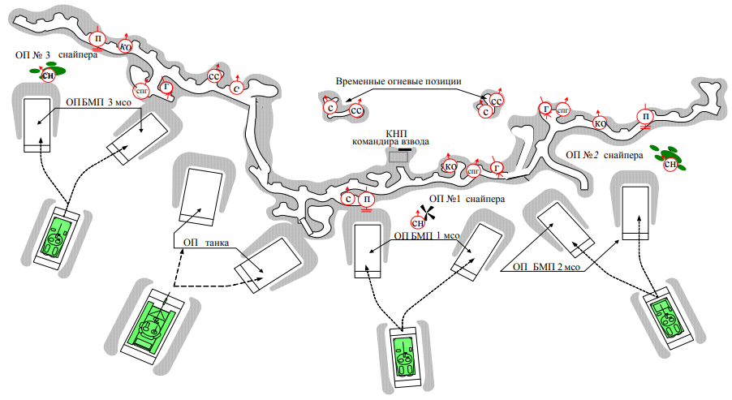

**Боевой порядок Взвода в наступлении**
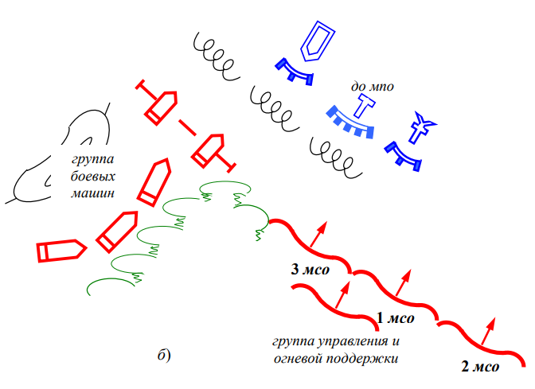

**Идеальная картина боевых действий**

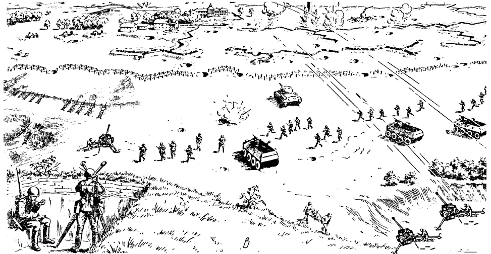

## Домашнее задание
1. Выписать основные термины:
   * Бой
   * Удар
   * Огонь
   * Манёвр и виды маневра
   * Походный, предбоевой и боевой порядки
   * Боевой порядок взвода
   * Состав боевых групп отделения
2. Прочитать следующие страницы [Боевого устава сухопутных войск ч.3](/tactics/files/bus-3.pdf){target="_blank"}: 4-8
3. Для вырабатывания навыка рисования схем, надо перерисовать на бумажном листе, желательно в цвете, все схемы из презентации.

Я не прошу высоко художественное исполнение. Надо сделать так, чтобы было похоже.
