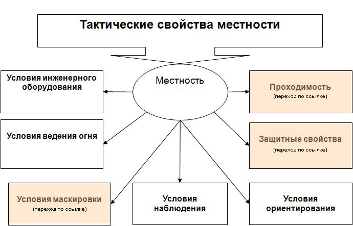

# Урок 02. Основы работы командира по подготовке боя

Качественная организация боя значительно увеличивает шанс успешного выполнения боевой задачи.

Организация боя включает следующие инструкции:

* получение боевой задачи от старшего начальника;
* уяснение полученной задачи;
* оценка обстановки;
* выработка решения;
* проведение рекогносцировки;
* постановку боевых задач и приказа подчиненным;
* организацию взаимодействия;
* организацию всестороннего обеспечения;
* организацию управления;
* доклад о готовности для выполнения боевой задачи.

Как правило, выполнение всех инструкций осуществляется на местности.
Если это невозможно, то организация боя проводится по карте (схеме) или на макете местности.<br>
В этом случае боевые задачи подразделениям и приданным средствам командир уточняет на местности, например, в ходе занятия позиций противника или на этапе рубежа перехода в атаку.

Опытные командиры выполняют все эти инструкции комплексно и одновременно, но на начальном этапе я рекомендую прорабатывать каждый пункт отдельно.

**_Очередность выполнения пунктов - при разных условиях меняется._**

На этом уроке мы познакомимся с понятиями «получение боевой задачи», **«уяснение полученной задачи» и «оценка обстановки»**

Получение, уяснение задачи и оценка обстановки очень часто проходят практически одновременно, те процесс понимания: что и как надо сделать начинается сразу же после получения боевого приказа.

## Уяснение полученной задачи

Уясняя задачу - это значит, что командир должен понять:

1. цель предстоящих действий;
2. задачи и замысел старшего начальника, особенно, способы разгрома противника. Это включает в себя:
   * место опорного пункта старшего начальника;
   * задачи по наступлению или обороне;
   * полосу огня и дополнительные секторы обстрела;
   * какими силами и средствами обеспечиваются фланги, стыки и промежутки между подразделениями и кто ответственный за них.
3. задачу своего и подчиненных подразделений, а именно:
   * где наносится главный удар (сосредоточение основных усилия)
   * назначенные ориентиры;
   * полосу огня и дополнительный сектор обстрела подразделения;
   * основной и дополнительный секторы обстрела с каждой позиции;
   * место подразделения в общем боевом порядке;
   * рубежи, с выходом противника на которые, подразделение открывает огонь;
   * характер маневров;
4. какие объекты или цели поражаются средствами старших начальников;
5. задачи соседей (их позицию, правую и левую границу полосы огня) и условия взаимодействия с ними;
6. средства связи, сигналы управления, взаимодействия, оповещения и порядок действий по ним;
7. срок готовности своего и подчиненных подразделения (дата и время);
8. очередность и сроки инженерного оборудования;
9. сроки, объем и порядок подготовки вооружения и военной техники;
10. время, место и порядок пополнения боеприпасов и других материальных средств;
11. порядок дозаправки машин горючим и смазочными материалами;
12. местонахождение пункта боевого питания и медицинского пункта;
13. пути эвакуации.

<br>

На основе уяснения боевой задачи командир делает **выводы**, в которых определяет:

* направление сосредоточения основных усилий;
* боевые задачи подразделениям;
* характер маневра и маршруты для проведения маневра;
* построение боевого порядка;
* темп наступления и другие вопросы.

<br>

Поняв поставленные задачи командир производит **расчет времени** для подготовки к бою на основе:

* нормативов,
* поставленных старшим начальником сроков
* и личного опыта.

## Оценка обстановки

Под оценкой обстановки понимаются совокупность всех объективных условий, в которых предстоит выполнять боевую задачу.
На этом этапе обычно изучаются условия поставленной боевой задачи, выявляются факторы, которые будут способствовать или затруднять ее выполнение.
Иначе говоря, оценка обстановки — это познание командиром объективных условий предстоящего боя и
нахождение наиболее правильных путей использования этих условий для успешного выполнения поставленной боевой задачи.

Оценка обстановки осуществляется с учетом прогноза ее изменения при подготовке и в ходе выполнения полученной задачи.<br>
Оценка обстановки заключается в изучении и анализе факторов и условий, влияющих на выполнение боевой задачи.

При оценке обстановки требуется понять:

1. вероятный состав противника, его силы и средства;
2. местоположение его огневых средств и характер действий;
3. с какого рубежа, в каком направлении и в каком составе противник может атаковать;
4. состав и оценку подчиненных подразделений и соседей, кол-во их сил и огневых средств;
5. условия взаимодействия с соседями и огневыми средствами старшего начальника;
6. защитные и маскирующие свойства местности и ее проходимость;
7. влияние местности на условия наблюдения и ведения огня;
8. трудоемкость фортификационного оборудования боевой позиции;
9. влияние погодных условий, времени года, суток;
10. и другие факторы, влияющие на выполнение полученной задачи.

По каждому элементу обстановки делаются выводы в интересах принятия решения и определения задач подразделениям.

Перечисленные выше элементы обстановки по-разному влияют на решение одного и того же вопроса.
В связи с этим и выводы, к которым приходит командир в результате их оценки, бывают не только различными, но и противоречивыми.

* В одном случае наибольшее влияние будет оказывать состояние или положение войск противника,
* В другом — состояние и положение своих войск,
* В третьем — особенности района боевых действий,
* В четвертом — время года, суток, условий видимости, погоды и т. д.

Однако из всех элементов противник является наиболее важным и динамичным элементом обстановки. Это объект боевого воздействия. <br>
От его действий во многом зависят действия наших войск. Поэтому оценку обстановки рекомендуется начать с оценки противника.

В результате оценки обстановки командир делает **выводы** и намечает отдельные **элементы решения**.

## Оценка противника

Командир оценивает противника на глубину выполнения боевой задачи.

**Глубина боевой задачи** — это расстояние от переднего края обороны противника (рубежа боевого соприкосновения) до района (рубежа),
с овладением которым завершается выполнение поставленной боевой задачи.

Данные о противнике, как правило, всегда будут недостаточными, а некоторые из них могут быть недостоверными, противоречивыми, устаревшими и даже ложными.
Однако командир должен уметь сопоставить имеющиеся сведения о противнике, учитывать его тактику, организацию войск, возможный характер действий и на основе этого сделать правильные выводы.

Оценку противника рекомендуется проводить в такой последовательности:

1. вначале изучить и уяснить общий характер действий, положение, состав, состояние и степень защищенности группировки противника в полосе наступления (на участке обороны),
2. затем оценить ту часть его группировки, которую надо разгромить при выполнении поставленной задачи, т. е. на фронте наступления,
3. и, наконец, опираясь на знания тактики противника и зная степень защищенности, систему укреплений, огня и заграждений, а также определив сильные и слабые стороны противника,
   командир раскрывает вероятный характер (замысел) его действий при выполнении задачи.

На основе анализа противника и вероятного характера его действий командир делает **выводы**:

* какой противник находится перед ротой (батальоном) и вероятный характер его действий;
* где главные силы группировки противника, от уничтожения которой резко понизятся его боевые возможности;
* сильные и слабые стороны противника.

Эти выводы дают возможность **определить**:

* направление сосредоточения основных усилий (участки местности, от удержания которых зависит устойчивость обороны);
* какого противника, каким способом и в какой последовательности разгромить;
* порядок поражения противника огнем штатных и приданных средств;
* боевой порядок;
* боевые задачи подразделениям;
* основные вопросы взаимодействия и порядок всестороннего обеспечения боя;
* организацию управления;
* что и к какому времени доразведать.

## Оценка своих подразделений

Под своими подразделениями понимаются штатные, приданные и поддерживающие подразделения. <br>
Свои войска командир обычно оценивает в такой последовательности:

1. вначале он уточняет положение штатных и приданных подразделений,
2. затем изучает их состав
3. и, наконец, определяет их боевые возможности для решения предстоящих задач.

Оценивая **положение своих войск**, командир изучает:

* положение подразделений по отношению к противнику и характер их действий (наступают, обороняются, находятся в районе, на марше);
* удаление подразделений от намеченного рубежа перехода в атаку (района обороны) и время, необходимое на их выдвижение;
* местонахождение, характер действий, время и районы прибытия приданных подразделений и смены занимаемых ими районов (позиций).

В процессе оценки **состава и состояния** командир анализирует:

* штатную структуру подразделений, все ли штатные подразделения в наличии, а если нет, то где они сейчас и когда прибудут;
* состав приданных подразделений; политико-моральное и физическое состояние личного состава, состояние вооружения и боевой техники;
* уровень подготовки и боевой опыт подразделений; организаторские способности командиров подразделений.

При оценке **обеспеченности** командир устанавливает:

* обеспеченность материальными средствами и сроки создания их запасов в подразделениях;
* нормы расхода материальных средств и потребность в них для выполнения боевой задачи;
* организацию подвоза и эвакуации;
* техническое и тыловое обеспечение.

При оценке **боевых возможностей** командир определяет возможности:

* артиллерии, минометов, БПЛА по поражению объектов противника, по уничтожению танков, ПТУР и других огневых средств;
* средств ПВО по борьбе с воздушными целями;
* мотострелковых и танковых подразделений по созданию превосходства над противником при прорыве его обороны (отражении атак перед передним краем).

Всесторонняя оценка своих войск позволяет командиру сделать **выводы**:

* каковы общее состояние, защищенность и боеспособность подчиненных подразделений;
* соответствует ли их положение характеру полученной боевой задачи, необходима ли перегруппировка и какое для этого требуется время;
* где сосредоточить основные усилия;
* как построить боевой порядок и распределить силы и средства;
* какие боевые задачи определить подразделениям, исходя из их возможностей;
* какие наметить основные вопросы по организации взаимодействия, всестороннему обеспечению боя;
* как организовать управление.

## Оценка соседей

Под соседями принято понимать подразделения, действующие на флангах (справа, слева), впереди или находящиеся в тылу, но в ходе боя действующие на направлении подразделения.

**Главная цель оценки соседей** заключается в определении их влияния на выполнение поставленной задачи и детализации порядка совместных действий с ними по разгрому противника.

Оценивая **характер их действий**, командир устанавливает:

* что делают они к моменту принятия им решения на бой,
* какой манёвр будут осуществлять при подготовке к выполнению поставленных боевых задач.

Оценивая **условия взаимодействия** с соседями, командир определяет:

* как соседи будут способствовать разгрому противника;
* какую помощь им необходимо оказать при выполнении боевых задач;
* какой манёвр силами и средствами осуществить в целях использования возможного успеха соседей;
* какие мероприятия провести для обеспечения флангов;
* какой предусмотреть порядок взаимодействия с соседями при разгроме противника.

В результате оценки соседей командир делает следующие **выводы**:

* как влияют действия соседей на выполнение задач;
* где целесообразно сосредоточить основные усилия, какого противника необходимо разгромить во взаимодействии с соседями;
* какие цели (объекты) противника поразить огневыми средствами на флангах с соседями;
* построение боевого порядка;
* с кем из соседей при разгроме какого противника следует наиболее тесно организовать взаимодействие и по каким вопросам;
* какую оказать помощь соседям при совместном уничтожении противника;
* какой манёвр силами и средствами предусмотреть в целях использования возможного успеха соседей;
* какие данные от соседей требуется дополнительно получить и какие вопросы согласовать в интересах поддержания взаимодействия и связи с ними в ходе боя;
* каков порядок пропуска подразделений через боевые порядки впереди действующих подразделений.

## Оценка местности

Командир изучает по карте местность в целях определения ее влияния на боевое применение своих войск и противника.
В результате ее изучения он устанавливает, **в какой степени местность способствует противнику в организации и ведении обороны и нашему наступлению.**

В войсковой практике выработана следующая методика изучения местности.

Вначале оценивается местность в **расположении противника**, а затем в **расположении своих войск**.



Местность оценивается обычно в такой последовательности:

1. Изучая **общий характер местности**, командир выявляет:

   * тип рельефа по карте,
   * местные предметы,
   * гидрографию (Водные объекты. Тактические свойства рек),
   * степень пересеченности и просматриваемости,
   * выгодные рубежи для обороны противника,
   * рубежи, с овладением которыми создаются условия для успешного развития наступления нашими войсками.

2. Изучая **условий наблюдения, обстрела, маскировки и расположения**, командир определяет:

   * условия наблюдения;
   * условия ведения огня;
   * маскирующие свойства местности;
   * командные высоты и другие места для наблюдения;
   * естественные маски, укрытия, выгодные районы для расположения элементов боевого порядка, пунктов управления и подразделений тыла;
   * выгодные рубежи развертывания, перехода в атаку, отражения (нанесения) контратак, дистанционного минирования;
   * условия маскировки;
   * вероятные направления действий самолетов, вертолетов и других воздушных целей противника на малых и предельно малых высотах и др.

3. Изучая **условия проходимости и защитные свойства местности**, командир устанавливает:

   * условия проходимости и защитные свойства в зависимости от рельефа, растительности, грунта;
   * наличие, состояние дорог, путей маневра, подвоза и эвакуации;
   * характер грунта и проходимости вне дорог; характер естественных препятствий;
   * наличие водных преград и технических сооружений на них, разрушение которых может затруднить действия подразделений;
   * возможные изменения, которые могут произойти в результате разрушения плотин, пожарах, затоплениях, ливневых дождях, снежных буранах и др.

В результате оценки местности командир **определяет**:

* как влияет местность на применение различных родов войск и на выполнение боевой задачи;
* наиболее доступные направления для действий наших войск и противника, где исходя из этого целесообразно было бы сосредоточить основные усилия,
    а в обороне, кроме того, определить районы местности, от удержания которых зависит устойчивость обороны;
* объекты противника для поражения огнем обычных средств (артиллерией, БПЛА, танков, ПТУР, противотанковых орудий, гранатометов и пулеметов);
* как построить боевой порядок и где разместить его элементы, подразделения обеспечения, КНП, направление его перемещения;
* рубежи ближайшей, дальнейшей задачи подразделений (в обороне — места расположения ротных и взводных опорных пунктов);
* участки форсирования водных преград,
* а также делает выводы, относящиеся к вопросам по взаимодействию, всестороннему обеспечению боя и организации морально-психологической работы.

## Домашнее задание

1. Получение боевого задания.<br>
   Представим, что вы командир взвода и ставите боевую задачу командиру 1-го отделения:<br>

   ```text
   Мы наступаем с севера, задача роты зачистить бывший пионерский лагерь Юбилейный.
   Ваше отделение должно досмотреть три 2-х этажных здания.
   В случае отсутствия противника, занять наблюдательные посты и доложить.
   В бой не вступать.
   ```

   А теперь поставьте себя на место командира 1-го отделения и подумайте, что вам не хватает, чтобы выполнить эту задачу (перечитайте «I. Уясняя задачу, командир должен понять»).
   Дополните и распишите описание боевой задачи.
   Это учебная задача, те можно домыслить (додумать максимально логичный и  реалистичный вариант) недостающую информацию.

2. Оценка обстановки.<br>
   Вы командира 1-го отделения.<br>
   Получив и усвоив боевую задачу, надо оценить обстановку.<br>
   Вспомните типовую структуру взвода из [Урока 1](../lesson-01/).<br>
   Распишите ваше понимание по каждому пункту из «II. Оценка обстановки»

## Приложение «Карта»

<https://nakarte.me/#m=18/55.66168/38.12772&l=E>

Примерный масштаб карты - 1:1500


