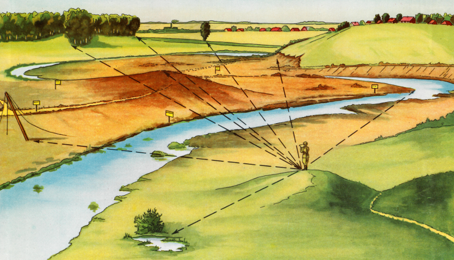
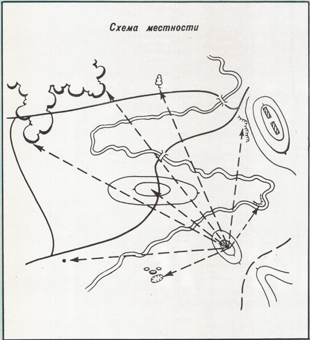
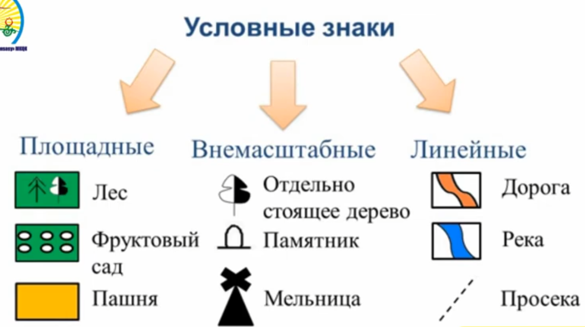
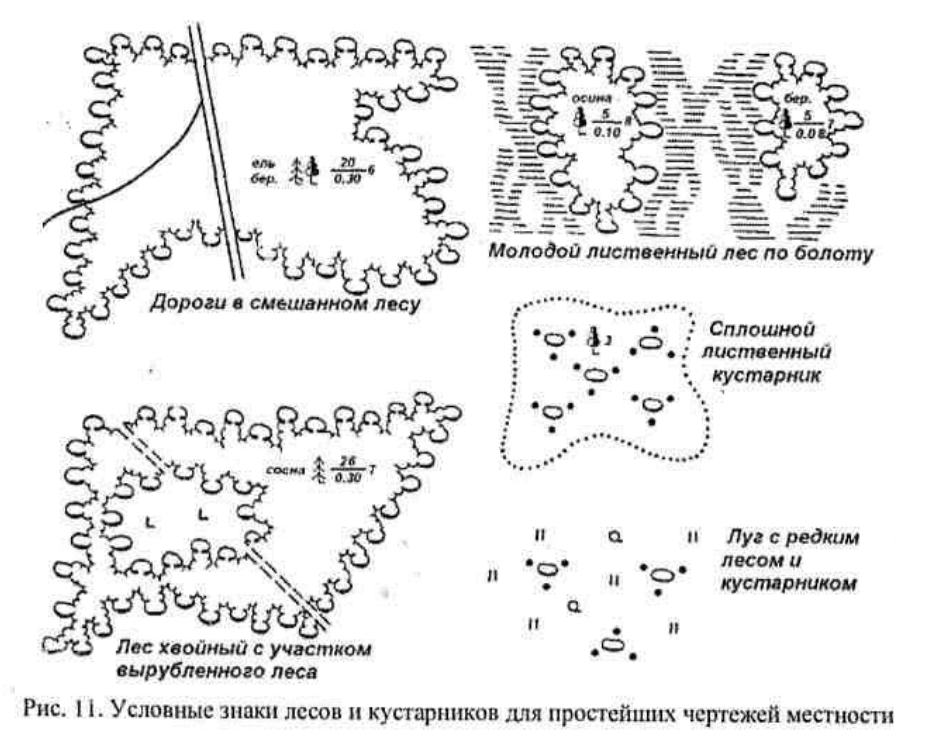
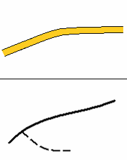
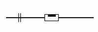
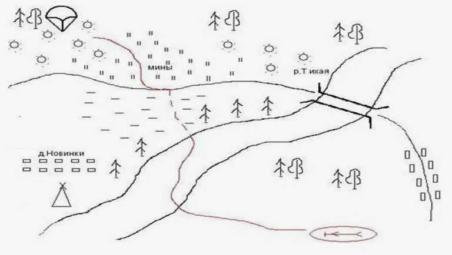
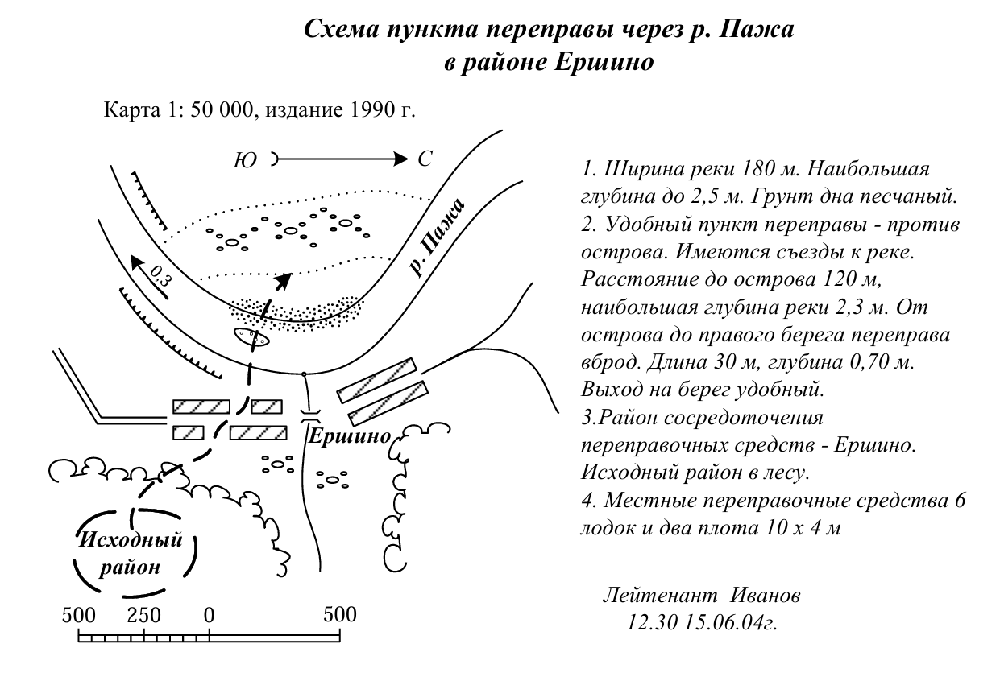
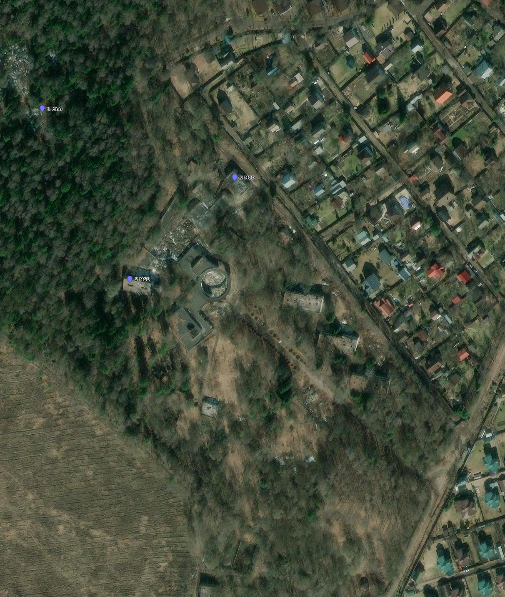

# Урок 03. Основы военной топографии
## «Схема местности»

Как правило, планирование боевой задачи проводится по карте, иногда, на макете местности. И очень часто, ни карту ни макет забрать из штаба старшего командира с собой нет возможности.

В этом случае следует оперативно начертить **Схему местности** - чертеж, на котором с приближенной точностью нанесены наиболее характерные местные предметы, а также отдельные элементы рельефа.

Составление схемы — это первый этап при оформлении карточки огня подразделения и рабочей карты командира.

Схема должна соответствовать 3-м принципам: **Быстро, Понятно, Точно**.

При составлении схем соблюдают следующие правила:
1. На схему наносят только те объекты, которые необходимы для конкретной тактической обстановки. А также те предметы местности и формы рельефа, которые позволяют, ориентируясь по ним, нанести в дальнейшем элементы боевых порядков своих подразделений и цели.
2. Схему ориентируют на листе бумаги так, чтобы противник находился со стороны верхнего края листа.
3. На свободном месте схемы стрелкой указывают направление на север.
4. Линию координатной сетки чертят по всему документу или частично в двух его противоположных углах.
5. При составлении схемы применяют общепринятые условные знаки, а при необходимости новые условные знаки, с пояснением их на полях схемы.
6. Необходимые дополнительные сведения, которые не возможно изобразить графически, излагаются текстом в легенде, помещаемой на полях или на обороте чертежа.
7. Все надписи тактических объектов выполняются так, чтобы они не закрывали собой другие объекты карты и нанесенную обстановку.
8. Масштаб схемы указывают внизу схемы. Если он приближенный, делают оговорку: например, «масштаб около 1:10 000».
9. Если масштаб по разным направлениям не одинаков, его значение не указывают, а указывают расстояние между объектами или от переднего края до ориентиров.

Перед составлением схемы уясняют ее предназначение в соответствии с поставленной боевой задачей. Это позволяет правильно отобрать и изобразить на схеме необходимые элементы местности.

В зависимости от поставленной задачи схемы различаются по видам:
* схема местности,
* схема ориентиров,
* схема района обороны подразделения,
* схема опорного пункта (ОП) подразделения,
* схема водной переправы
* схема маршрута и тп.

Масштаб топографической карты часто не позволяет подробно отобразить на ней местоположение элементов боевого порядка, систему огня и другие данные. Поэтому схемы местности составляют в более крупном масштабе.

При составлении схемы вначале наносится точка своего местонахождения, определяются стороны горизонта (север или юг) и наносится **самый дальний ориентир** (используется в качестве исходного ориентира).
Расстояние от своего местонахождения до дальнего ориентира служит масштабом при нанесении других ориентиров, местных предметов и целей. 

При вычерчивании длинных кривых линий не следует проводить их сразу непрерывным движением карандаша. Нужно сначала наметить положение такой линии,
а затем наносить ее короткими штрихами, накладывая их последовательно один на другой.

## Общепринятые условные знаки
При составлении схемы применяют:  

  

Опушки леса вычерчивают различной величины полуовалами, соединенными между собой небольшими дужками. При изображении сплошного леса должна получаться замкнутая линия, отображающая общий контур леса с наиболее характерными его изгибами. Внутри контура ставят пояснительные знаки и подписи (порода деревьев, затем в числителе - средняя высота деревьев, в знаменателе - средний диаметр ствола дерева (на уровне груди), рядом, среднее расстояние между деревьями в метрах). 

Кустарники изображают овалами с точками. Овалы располагают произвольно. 
При изображении сплошного кустарника овалы располагаются чаще, а между смежными овалами ставят точки. 
  

|                          | Асфальтовые дороги, вычерчиваются в две линии.    Грунтовые дороги, вычерчиваются в одну линию.                                                                            |
|-------------------------------------------------|----------------------------------------------------------------------------------------------------------------------------------------------------------------------------------|
|                          | Железные дороги изображаются утолщенной черной линией с поперечными одинарными, двойными или тройными штрихами, показывающими коллейность дороги.                                |
|   | Внемасштабные условные знаки, как отдельно стоящие деревья, фабричные трубы, церковь и тому подобное, следует вычерчивать примерно в 1,5 - 2 раза крупнее остальных эелементом.  |

## Примеры схем

 

## Домашнее задание

1. Изучите файлы «[Топографические обозначения.pdf](/tactics/files/znak-in-doc.pdf){target="_blank"}» и «[Обозначения в боевых документах.pdf](/tactics/files/topo-znak.pdf){target="_blank"}»
2. Составьте схему. 
Представим, что вы командир 1-го отделения. 
Командир взвода поставил вам боевую задачу и показал карту (воспользуйтесь своим решением дом задания из [Урока 2](../lesson-02/)). 
Но в распечатанном виде не выдал - это секретная информация. 
Надо быстро составить схему карты и нанести на неё данные из боевой задачи и отбыть в отделение для выработки своего решения.

Достаточно показать на схеме:
* границы леса,
* дачный поселок,
* пионерский лагерь,
* ваше расположение и соседних отделений,
* вероятное расположение противника

## Приложение «Карта»

https://nakarte.me/#m=18/55.66168/38.12772&l=E

Примерный масштаб карты - 1:1500

