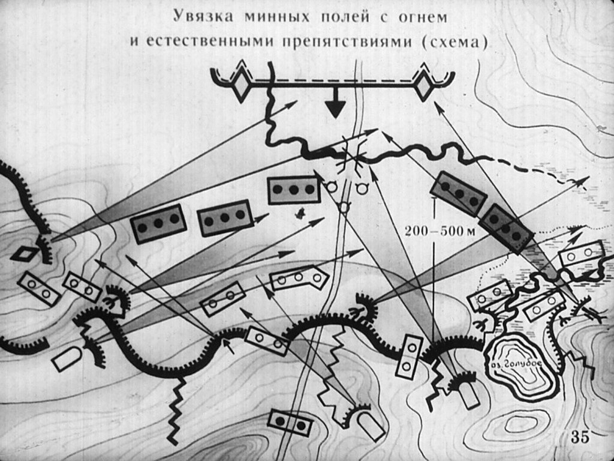
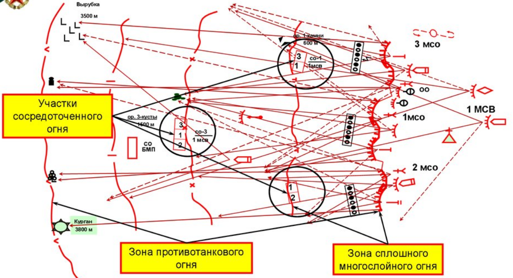
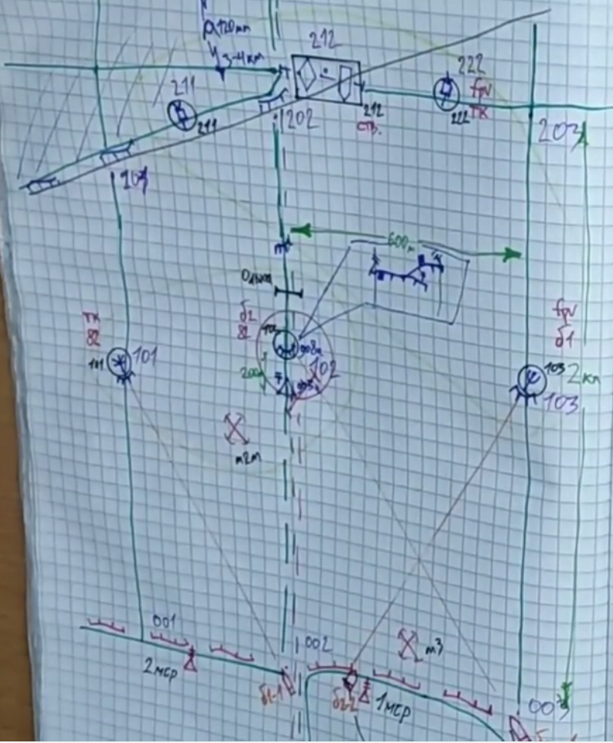
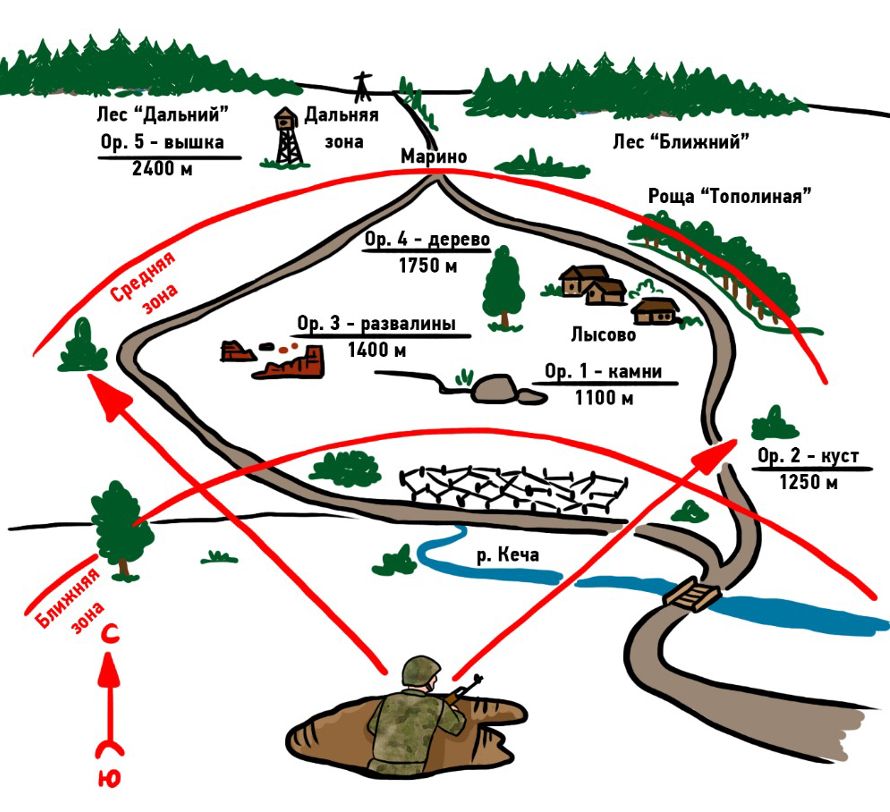
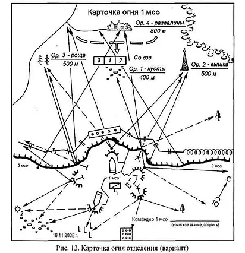
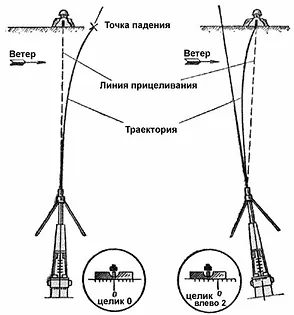
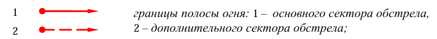
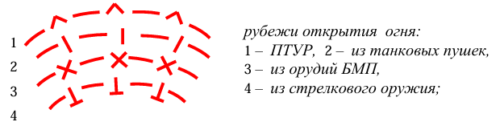
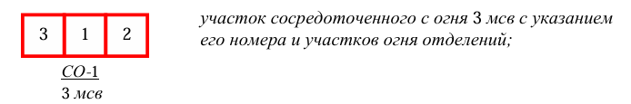
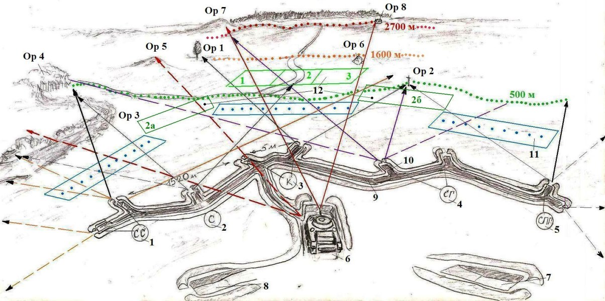

# Урок 04. Основы организации системы огня. Часть 1

## «Система огня»

С появлением огнестрельного оружия основным средством выполнения тактических задач становится огонь.

**Система огня** – это организованное и эффективное использование всех видов имеющегося вооружения для борьбы с противником.

Система огня строится на взаимодействии огня артиллерии, стрелкового оружия, противотанковых и противовоздушных средств с учетом их огневых и маневренных возможностей в сочетании с инженерными заграждениями и естественными препятствиями для создания высокой плотности огня на заданных направлениях.

Система огня организуется в процессе всей работы командира и отражается в его решении, в боевом приказе и в указаниях по взаимодействию.

**Чтобы организовать систему огня**, командир:
1. изучает и оценивает местность;
2. назначает и кодирует ориентиры;
3. продумывает систему наблюдения за полем боя;
4. оценивает огневые возможности имеющегося вооружения;
5. выбирает расположение огневых позиций и рубежи открытия огня;
6. подготавливает исходные данных для стрельбы;
7. назначает сигналы управления огнем;
8. ставит огневые задачи огневым средствам, личному составу и приданным подразделениям;
9. организовывает связь по управлению огнем;
10. проводит мероприятия, оказывающие влияние на четкое управление огнем (изучение правил стрельбы, сигналов, таблиц, а также подготовка приборов и вооружения к боевому применению);
11. создает необходимый запас боеприпасов.

**Система огня** включает:
- подготовленный огонь дежурных огневых средств;
- зоны противотанкового огня и сплошного многослойного огня всех видов оружия;
- участки сосредоточенного огня;
- рубежи заградительного огня артиллерии и минометов;
- подготовленный манёвр огнем для его сосредоточения в короткие сроки на угрожаемом направлении или участке.

 

Система огня считается готовой, если все огневые средства заняли свои огневые позиции (места для стрельбы), подготовлены данные для стрельбы и имеется в наличии необходимый запас боеприпасов.

## 1. Оценка местности
При оценке местности на территории противника определяются:
   * возможности его скрытного выдвижения и развертывания;
   * возможный рубеж перехода противника в атаку,
   * вероятное сосредоточение или направление основных усилий,
   * возможные места командных и наблюдательных пунктов,
   * наличие мертвых пространств перед передним краем,
   * танкоопасные, вертолетоопасные и дроноопасные направления.

При оценке местности на своей территории изучаются:
* возможности использования рельефа для наивыгоднейшего построения обороны и системы огня,
* места размещения огневых средств, в первую очередь противотанковых,
* возможность создания зон сплошного многослойного противотанкового огня, стрелкового и всех других видов оружия перед передним краем,
* а так же на флангах, в глубине обороны и в промежутках между подразделениями;
* возможность создания огневых мешков,
* возможность ведения флангового, перекрестного и кинжального огня,
* возможность маневра огневыми средствами.

При обороне, на основании изучения противника, своих войск и оценки местности командир определяет:
* где сосредоточить основные усилия обороны;
* границы опорных пунктов;
* где расположить резерв, огневые позиции личного состава (основные и запасные), танков, БТР, БМП;
* сектора обстрела или полосы огня
* рубежи открытия огня;
* границы зон открытия противотанкового огня;
* участки сосредоточения огня
* необходимые работы по расчистке секторов обстрела;
* силы и средства для борьбы с вертолетами, самолетами и десантами противника;
* порядок расхода и пополнения боеприпасов.

При ведении наступательных действий, после изучении местности на территории противника командир определяет:
* места вероятного размещения элементов боевого порядка противника и его огневых средств;
* характер вероятных действий противника;
* на каких направлениях/рубежах, по каким участкам и районам какие виды огня следует применить;
* ориентиры, рубежи, участки, где может быть достигнуто наибольшее поражение противника сосредоточенным и заградительным огнем.

## 2. Ориентиры
В качестве ориентиров выбираются трудноразрушимые объекты:
* гребни высот,
* окончание оврагов и лощин,
* изгибы дорог,
* оконечности лесных массивов,
* подбитая техника,
* отдельные или окраинные строения и т. п.

Достаточно 4-6 ориентиров. Они нумеруются справа-налево и по рубежам от себя в сторону противника (более подробно мы это рассмотрим при построении карточки огня).

По ГЛУБИНЕ ориентиры назначаются на рубежах действительного огня своего подразделения и приданных средств (те дальность до ориентиров должна соответствовать возможностям вооружения):

Например,
* для стрелкового оружия (автоматы и пулеметы) это ближние рубежи в 600м и 1000м,
* для танков, БМП, ПТУР – это ближние и средние рубежи до 2-х с половиной км,
* артиллерийским и минометным орудиям готовят дальние ориентиры до 5км
* ударные FPV-дроны до 10км

## 3. Наблюдение — основной способ войсковой разведки
Наблюдение позволяет получать наиболее достоверные сведения о противнике и местности. Во всех видах боя оно ведется непрерывно и специально назначенными наблюдателями и наблюдательными постами. Их количество зависит от характера боя, условий обстановки и местности. 
В отделении обычно назначается один наблюдатель, во взводе - два-три наблюдателя. 
Наблюдение организуется так, чтобы обеспечивался наилучший просмотр местности перед фронтом и на флангах.

Основными требованиями, предъявляемыми к наблюдению, являются:
* непрерывность наблюдения;
* преемственность в наблюдении;
* своевременность донесений и осведомления;
* достоверность данных наблюдения и точность указания целей;
* скрытность наблюдения.

Разведка наблюдением, организованная до боя, непрерывно продолжается и в ходе боевых действий.

**Важные цели** - огневые средства противника, которые своими огневым возможностям способны нанести существенные потери нашим подразделениям.  
Или поражение которых может облегчить или ускорить выполнение боевой задачи.

Важными целями, обычно, являются:
* танки, БМП, БТР, артиллерийские установки и минометы,
* гранатометы, пулеметы, установки ПТУР,
* точки запуска БПЛА,
* командные и наблюдательные пункты,
* радиолокационные станции и т. п

Важные цели, в пределах досягаемости которых находятся наши подразделения, называются **опасными**.

А те цели, которые в данный момент находятся от наших подразделений на расстояниях, превышающих дальность их действительного огня, можно считать **неопасными**.

Деление целей на опасные и неопасные, важные и менее важные позволяет командиру быстро и правильно принимать решение об очередности их поражения:

1. В первую очередь должны уничтожаться опасные цели,
2. Во вторую очередь - важные цели,
3. а затем все остальные.

## 4. Огневые возможности
Для каждой цели нужно подбирать огневое средство с наибольшей эффективностью. 
Возможности огневых средств оцениваются по:
   * дальность стрельбы,
   * точность стрельбы,
   * боевая скорострельность,
   * эффективности боеприпасов.

А огневые возможности подразделения - это общий объем огневых задач, который может быть выполнен всеми огневыми средствами подразделения в определенное время или установленным количеством боеприпасов.

При выборе вида оружия исходят из следующих положений:
* артиллерийские подразделения обычно привлекают для поражения:
* вражеской артиллерии и минометов,
* командных пунктов,
* танков,
* противотанковых и других огневых средств,
* а также живой силы противника;

* огонь из автоматических пушек, установленных на БМП и БТР применяют для борьбы:
    * с небронированными целями, живой силой и огневыми средствами противника на дальности до 2км;
    * а для борьбы с легкобронированными целями на дальности до полутора км;

* комплексы ПТУР и FPV-дроны предназначены:
    * для поражения бронецелей противника на дальности
        * ПТУР до 4км;
        * FPV-дроны до 10км;
    * для поражения живой силы и огневых средств противника, находящихся в железобетонных, кирпичных и дерево-земляных сооружениях;
    * для борьбы с десантнопереправочными средствами противника при обороне речных, морских и океанских побережий;

* автоматические противопехотные и подствольные гранатометы используются для уничтожения и подавления живой силы и огневых средств противника, расположенных вне укрытий или в открытых окопах, за естественными складками местности (в лощинах, оврагах, на обратных скатах высот);

* стрелковое оружие используются для поражения живой силы, огневых средств, автомобилей, мотоциклов:
  * автоматы на дальности до 600м
  * ручные пулеметы - до 1км,
  * крупнокалиберные пулеметы - до 2км.

## 5. Расположение огневых позиций
**Огневая позиция** – это место (участок местности), занятое или подготовленное к занятию огневыми средствами и подразделениями для ведения огня. 

Выбор огневых позиций - это трудоемкий процесс. Командир должен с каждого намечаемого места проверить возможность ведения огня в нужных направлениях.
Обойти и сравнить все предполагаемые места для позиций, выбрать из них наилучшие.
Огневые средства подразделения должны располагаться скрытно, поэтому не следует выбирать позиции вблизи заметных ориентиров, а также на гребнях высот.

Огневые позиции по своему назначению подразделяются на:
* основные,
* запасные,
* временные,
* ложные.

**Основные огневые позиции** предназначаются для выполнения основных задач в наиболее ответственные периоды боя.
В оборонительном бою выбираются и оборудуются для стрельбы прямой наводкой основные огневые позиции, позволяющие вести сосредоточенный огонь на любом направлении, а также поражать противника фланговым и перекрестным огнем.
Они оборудуются окопами, обеспечивающими укрытие от прямого попадания.

**Запасные огневые позиции** предназначаются для осуществления маневра в ходе боя, а также на случай невозможности выполнения поставленной задачи с основной позиции и занимаются после преднамеренного или вынужденного оставления основных огневых позиций. 
Каждому из огневых средств подготавливаются 1-2 запасные позиции.

**Временные огневые позиции** выбираются для выполнения отдельных боевых задач:
* поддержки действий подразделений, обороняющих передовую позицию или позицию боевого охранения;
* отражения разведки противника;
* ведения огня на большие дальности и ночью;
* а также для введения противника в заблуждение относительно истинного построения системы огня.

После выполнения поставленной задачи, по указанию командира, временные огневые позиции оставляются.

**Ложные огневые позиции** создаются для введения противника в заблуждение относительно истинного положения огневых средств и для привлечения на них огня противника.
Они оборудуются макетами орудий и танков, окопами, ровиками с оставлением демаскирующих признаков.
Чтобы они могли выполнять свою роль, с них необходимо периодически вести огонь, обозначать движение техники и людей.

Командир, организуя систему огня, должен наметить и выбрать при наличии времени и средств, все виды огневых позиций. 
Позиции выбираются с учетом условий местности с таким расчетом, чтобы обеспечивалось наблюдение за противником и ведение огня на предельную дальность.

В зависимости от степени укрытия огневые позиции могут быть:
- Открытыми - огневые средства наблюдаются противником с наземных наблюдательных пунктов или обнаруживаются во время стрельбы по вспышкам выстрелов, дыму и клубам пыли.
- Закрытыми - имеющие впереди укрытие, исключающее возможность наблюдения противником не только огневого средства, но и вспышек от выстрелов, дыма и пыли, образующихся при стрельбе.

Все огневые позиции должны быть оборудованы для ведения огня как днем, так и ночью, быть хорошо замаскированными и иметь укрытия (щели) для личного состава. 
При организации обороны надо учитывать, что инженерные заграждения и подступы к ним должны хорошо просматриваться и простреливаться огнем всех видов оружия.

Определим условия для выбора огневых позиций:
* это хороший обзор и возможность ведения огня в основном и дополнительном секторах обстрела;
* возможность стрельбы на предельную дальность в заданных направлениях и поражения противника сосредоточенным огнем;
* надежное укрытие от различных средств поражения противника;
* по возможности скрытые пути подхода, выдвижения и перемещения на запасную огневую позицию;
* хорошую маскировку от наблюдения противника;
* возможность взаимной огневой поддержки и ведения огня в промежутках между подразделениями, во флангах и поверх своих подразделений;
* возможность ведения огня ночью.

## 6. Подготовка исходных данных

Подготовка исходных данных для стрельбы является важным этапом при организации огневого поражения и управления огнем.
В подготовку исходных данных для стрельбы из стрелкового оружия также включают выбор вида и способа ведения огня.

Для стрелкового оружия наиболее типичными целями являются:
- установленные на позициях огневые средства, в первую очередь противотанковые, амбразуры оборонительных сооружений;
- живая сила противника, которая в силу создавшейся боевой обстановки вынуждена некоторое время находиться под прицельным огнем;
- расчеты огневых средств;
- залегшая вне укрытий пехота,
- наблюдатели и т. д.

При организации системы огня в обороне вне непосредственного соприкосновения с противником, как правило, имеется возможность достаточно точно определить дальность до ориентиров и вероятных рубежей появления противника по карте - промером. Иногда можно воспользоваться дальномером или данными артиллерийских разведчиков. А при определении расстояний глазомером - использовать средние данные нескольких измерений.

Результаты определения расстояний до ориентиров и рубежей сообщаются всем стрелкам и заносятся в карточку огня отделения и схему опорного пункта подразделения.

В подобных условиях весьма полезно также заблаговременно рассчитывать и поправки на реально имеющийся боковой ветер.
- Для оружия, имеющего целик, поправки на боковой ветер выгоднее рассчитывать в тысячных и учитывать их установкой целика на дальность до наиболее вероятного рубежа открытия огня.
- Для остальных образцов оружия поправки на боковой ветер определяют в фигурах человека.

Величины рассчитанных поправок на боковой ветер сообщаются всем стрелкам и могут заноситься в карточку огня и схему опорного пункта.
С изменением скорости и направления ветра поправки соответственно изменяются.

Подобные расчеты могут значительно повысить точность подготовки исходных данных и ускорить открытие огня по появляющимся целям.
Каждый командир обязан использовать все возможности для заблаговременной подготовки стрельбы.

В целом заблаговременная подготовка исходных данных создает лучшие условия для надежного решения огневых задач и управления огнем подразделений. 
В бою, как правило, такой возможности командиры подразделений не будут иметь.

Но решающее значение для успешного поражения целей в бою будут иметь навыки всех стрелков в самостоятельном отыскании целей,
определении расстояний в незнакомой местности и умение корректировать огонь по наблюдению за трассерами и местами падения пуль.

## 7. Сигналы управления огнем

Для осуществления четкого управления устанавливаются сигналы управления огнем:
- по радио (трехзначными цифрами или условными словами),
- зрительные (ракетами, трассирующими пулями и т. п.),
- звуковые(голосом, сиреной и т. п.).

Сигналы по радио должны быть короткими, легко запоминаемыми, требующими на передачу минимальное время.  
Целеуказание трассирующими пулями осуществляется стрельбой в направлении целей длинными очередями.  
Сигналы, подаваемые ракетами, трассирующими пулями, должны по возможности дублироваться по средствам связи.

Сигналы, установленные старшими командирами, изменять запрещается.

Для подразделения устанавливаются следующие сигналы управления огнем:
* сигналы переноса огня;
* сигналы сосредоточения огня подразделения;
* сигналы открытия и прекращения огня артиллерии (минометов), танков и БМП (БТР);
* сигналы целеуказания от танков мотострелкам, от них танкам, а также между соседними подразделениями;
* сигналы опознавания и целеуказания для своих самолетов и вертолетов.

## 8. Огневые задачи

Огневые задачи в период организации боя включают:
- назначение полос огня,
- секторов обстрела,
- участков сосредоточенного огня (СО) и порядка его ведения,
- рубежей открытия огня.

**Основной сектор обстрела** (полоса огня) и дополнительный сектор обстрела. 
  Полосы огня определяются границами справа и слева с указанием ориентиров. 
  Полосы огня на стыках должны взаимно перекрываться. 
  

**Рубежи открытия огня**  (огонь из соответствующего вооружения открывается по противнику в момент достижения им условной линии на местности или определенного ориентира), 
  

**1-2 участка сосредоточенного огня**  (огонь открывается несколькими огневыми средствами по одному участку местности с выходом на него противника). 
  Участок сосредоточенного огня представляет собой хорошо просматриваемую ограниченную площадь местности, расположенную в пределах прицельной дальности стрельбы.   Участки выбираются с учетом условий местности (например, перекрестки дорог), чтобы сковать действия противника или уплотнить его боевой порядок. 
  Размеры участков сосредоточенного огня по фронту и в глубине определяются огневыми возможностями подразделений.  По ширине участки должны соответствовать величине зоны осколочного действия снаряда, а по глубине - величине рассеивания снарядов. 
  

**Пример схемы** расположения отделения в обороне с указанием секторов, зон и рубежей огня (**_не путать с карточкой огня!_**)

1 – старший стрелок (РПКС);
2 – стрелок (АКС);
3 – командир отделения (АКС);
4 – стрелок-гранатометчик (АКС, РПГ-7Д);
5 – стрелок-помощник стрелка-гранатометчика (АКС);
6 – позиция БМД-2; 7,8 – запасные позиции БМД-2;
9 – траншея;
10 – ячейка;
11 – минно-взрывные заграждения;
12 – зоны сосредоточенного огня

Ор 3 – овраг;
Ор 4 – роща светлая;
Ор 5 – бугор;
Ор 1 – отдельно стоящее дерево;
Ор 7 – высота «Боб»;
Ор 8 – отдельно стоящий дом;
Ор 6 – белый камень;
Ор 2 – столб с косой подпоркой

2700 м – рубеж открытия огня ПТУРС;
1600 м – рубеж открытия огня орудия БМД-2;
500 м – рубеж самостоятельного открытия огня

## 9. Организация связи

Основными средствами связи командира подразделения по управлению огнем являются радио, проводные и сигнальные средства.   
Командиры взводов, рот и батальонов должны знать позывные своих командиров.

Связь проводными средствами в обороне в мотострелковом батальоне от командно-наблюдательного пункта с командирами подразделений организуется по направлениям.
Командир батальона управляет огнем по радиосети командира батальона в составе радиостанций командиров мотострелковых рот, взводов и БМП (БТР), танков.

При действии батальона в пешем порядке связь организуется по той же радиосети, но с применением переносных радиостанций.  
Командир роты (взвода) управляет ротой (взводом) по радио, командами, подаваемыми голосом, сигнальными средствами и личным примером.  
Командир отделения управляет подчиненными командами, подаваемыми голосом, сигнальными средствами и личным примером.

## Домашнее задание

1. Посмотреть видео  **«Оценка боевых возможностей отделение/взвод и организация огня»** 
   <video controls="controls" src="./Мотострелковый взвод - оценка боевых возможностей.mp4" />
    
2. Найти в интернете и выписать основные тактико-технические характеристики:
    1. Оборонительные гранаты
    2. Наступательные гранаты
    3. Стрелковое оружие: АК-74, АК-12
    4. Подствольный гранатомет и виды боеприпасов
    5. РПГ-7 и виды боеприпасов
    6. ПКМ и РПК
    7. СВД
