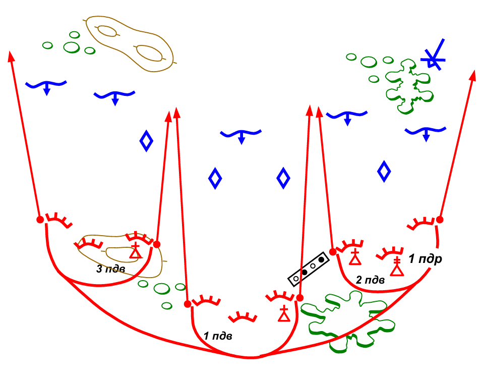
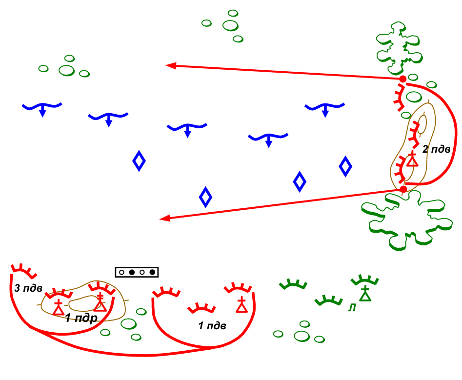
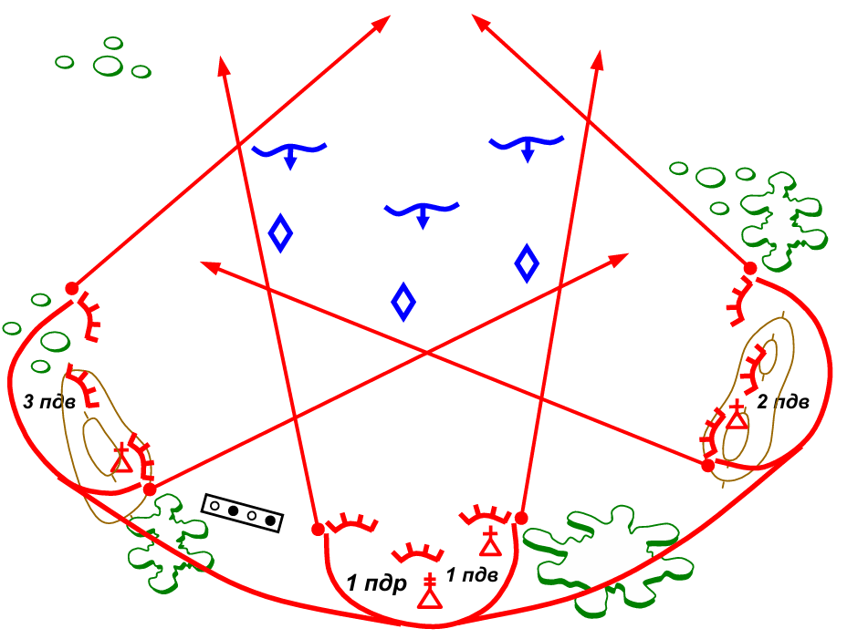
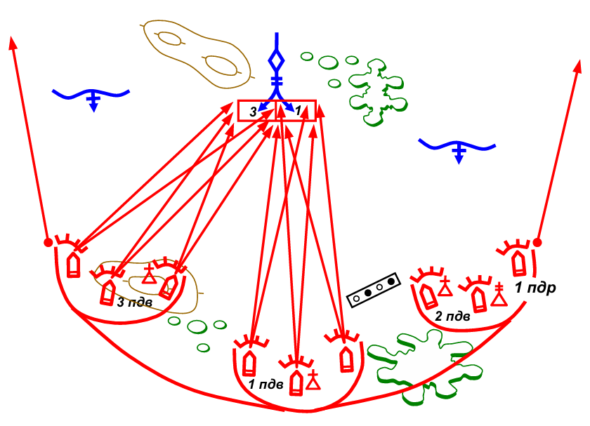
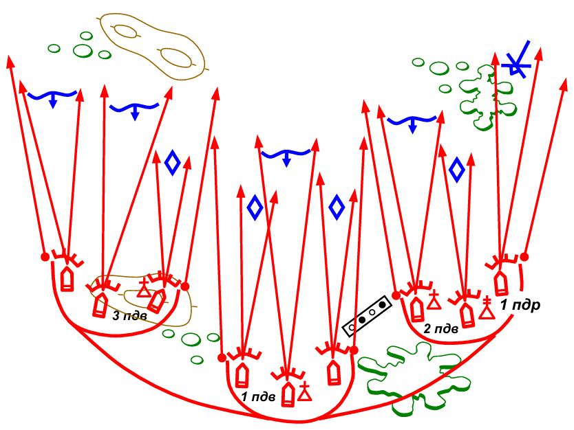
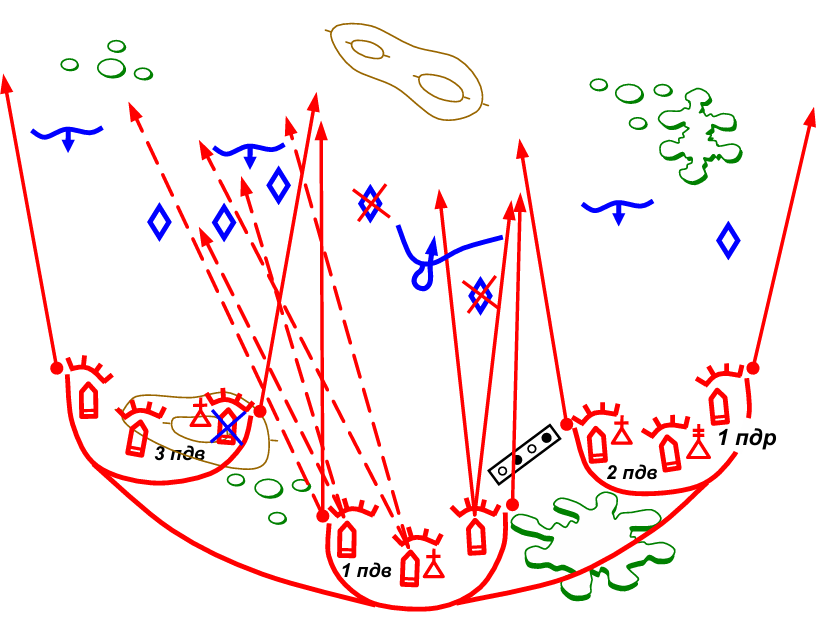

# Урок 05. Основы управления огнем подразделения

**Управление огнем** - это комплекс мероприятий, проводимых командиром при подготовке и в ходе выполнения полученной задачи
для своевременного и, самое главное, эффективного применения огневых средств.

В реальной работе командира вопросы организации огня до боя и управление огнем в ходе его не выделяются в отдельные процессы.
Эти вопросы рассматриваются и решаются командиром при уяснении полученной задачи, оценке обстановки, принятии решений, организации взаимодействия и т.д.

Мероприятия, проводимые по управлению огнем, обычно разделяют на два этапа:
- [организацию системы огня](../lesson-04/);
- управление огнем в ходе боя.

Успешное **Управление огнем** в ходе выполнения полученной задачи достигается:
- своевременной разведкой наземных и воздушных целей, оценку их важности и определение очередности поражения;
- правильным использованием огневых средств в соответствии с их боевыми возможностями;
- целеуказанием, своевременной и четкой постановкой огневых задач и подачей команд на открытие огня;
- меткостью огня, внезапностью его применения, ведением с предельной плотностью и максимальной интенсивностью;
- наблюдением за результатами огня и его корректированием;
- применением наиболее выгодных маневров огнем для достижения огневого превосходства над противником;
- поддержанием устойчивой связи для управления огнем;
- контролем расхода боеприпасов.

При управлении огнем командир обязан:
- знать установленные ориентиры, а если необходимо, назначить свои - дополнительные;
- непрерывно наблюдать за полем боя, быстро обнаруживать и оценивать цели, выбирать из них наиболее опасные (важные) для уничтожения в первую очередь;
- знать огневые и тактические возможности применения огневых средств, как своих, так и противника;
- выбирать наиболее выгодные огневые средства, боеприпасы, метод и способ огневого поражения целей противника;
- рационально распределять огневые задачи между подразделениями и огневыми средствами, а также своевременно ставить огневые задачи своим, приданным и поддерживающим подразделениям;
- осуществлять манёвр огнем, добиваясь огневого превосходства над противником;
- осуществлять контроль за расходом боеприпасов и принимать меры к их пополнению до нормы;
- докладывать своему командиру об израсходовании 0,5 и 0,75 боекомплекта.

Управление огнем должно быть непрерывным, устойчивым, гибким и обеспечивать своевременное выполнение огневых задач с высокой вероятностью поражения противника, с наименьшим расходом боеприпасов и времени.

Система огня, подготовленная командиром, не является жесткой и неизменной. Она постоянно уточняется и меняется по мере развития боя в соответствии со складывающейся ситуацией.

## Виды огня

Для принятия правильного решения командир обязан знать в каких случаях какой огонь более эффективен.

Огонь различается:
- По решаемым тактическим задачам;
- По силе или напраженности стрельбы;
- По видам оружия;
- По способам ведения;
- По направлению стрельбы;
- По видам огня.

**По решаемым тактическим задачам:**
- Уничтожение цели заключается в нанесении ей таких потерь (повреждений), при которых она полностью теряет свою боеспособность.
- Подавление цели заключается в нанесении ей таких потерь (повреждений), при которых она временно лишается боеспособности, ограничивается ее манёвр (огнем, движением) или нарушается управление.
- Изнурение заключается в морально-психологическом воздействии на живую силу противника ведением беспокоящегося огня ограниченным количеством орудий (минометов), танков, боевых машин пехоты, других огневых средств и боеприпасов в течение установленного времени.
- Разрушение цели заключается в приведении ее в непригодное состояние, а оборонительные сооружения не могут быть использованы для дальнейших действий.

<hr>

**По напряженности различают следующие виды огня:**
- одиночный,
- очередями (короткие очереди - от двух до пяти выстрелов, длинные - до десяти выстрелов)
- и непрерывный (очередь свыше 10 выстрелов),
- кинжальный,
- беглый,
- залповый и др.

**Одиночным огнем** поражают близко расположенные или менее важные неподвижные цели,
когда времени на выполнение задачи достаточно, цель отлично видна, или особое значение имеет экономичность стрельбы.

**Огонь очередями** менее экономичен, но, как правило, позволяет решить огневую задачу в более короткое время, особенно при недостаточно хороших условиях наблюдения.
Длина очереди зависит от размеров цели, дальности стрельбы и вида оружия.

Одиночную, ясно видимую цель выгоднее всего обстреливать короткими очередями длиной три — пять выстрелов.
Чем опаснее цель и чем дальше она находится, тем длиннее должна быть очередь. Рекомендуется на дальности свыше 400 м вести огонь длинными очередями.

```
Эксперименты показывают, что при стрельбе из РПК
пулеметчиком со средней подготовкой
по бегущей фигуре на дальности 400 м
для получения одного попадания средний расход патронов равен:
- одной очередью – 14,
- двумя очередями – 12,
- тремя очередями – 9.

Те в этих условиях наиболее выгодно вести огонь
тремя очередями длиной в среднем 3 выстрела каждая.
```

**Непрерывный огонь** применяется в напряженные моменты боя по наиболее важным и опасным целям, главным образом, групповым.

**Кинжальный огонь** – огонь, открываемый внезапно с близких расстояний в одном направлении.
Он подготавливается и ведется с замаскированных позиций до полного уничтожения противника или воспрещения его попыток продвинуться в данном направлении.

**Беглый огонь** ведется из одного или нескольких БМД, орудий и минометов; выстрелы следуют один за другим по мере готовности максимальным темпом, без нарушения режима огня и не в ущерб точности наводки.

**Залповый огонь** – огонь, при котором выстрелы производятся одновременно или в кратчайший промежуток времени по команде (сигналу) командира подразделения.

При выборе вида огня по напряженности необходимо иметь в виду:
- что во всех случаях более напряженный огонь быстрее приводит к нагреву ствола оружия
- и, следовательно, к более быстрому его износу,
- что, в свою очередь, приводит к большему рассеиванию пуль.

<hr>

**Огонь делят по видам оружия на:**
- стрелкового оружия,
- гранатометов,
- танков,
- боевых машин пехоты (бронетранспортеров),
- артиллерии,
- минометов,
- противотанковых ракетных комплексов,
- зенитных средств и другие;

<hr>

**По способу ведения огонь** подразделяется на:
- прямой наводкой;
- полупрямой наводкой;
- с закрытых огневых позиций;
– в одну точку;
– с рассеиванием по фронту;
– с рассеиванием в глубину;
– с одновременным рассеиванием по фронту и в глубину.

**Прямой наводкой** называется наводка, которая осуществляется при стрельбе с открытой огневой позиции по наблюдаемой цели (цель видна в прицеле).
Она ведется обычно из автомата, пулемета, снайперской винтовки, ручного противотанкового гранатомета, БМД (БТР), противотанковых ракетных комплексов и других средств.

**Полупрямая наводка** применяется тогда, когда цель видна в прицеле, но дальность до нее превышает нарезку шкалы прицела.
Стрельба полупрямой наводкой осуществляется из БМД (БТР), АГС-17 и другого оружия.

**Непрямой** называется наводка, когда оружию положение для стрельбы устанавливается по горизонту с помощью азимутального указателя (угломера), а по высоте – с помощью бокового уровня.
Такая наводка осуществляется при стрельбе из БМД, артиллерийских орудий с закрытых огневых позиций, ночью и в других условиях, когда цель не видна стреляющему.

**Стрельба с закрытых позиций** — ведение минометного и артиллерийского огня по целям, которые находятся вне прямой видимости.

<hr>

**По направлению огонь бывает:**
- фронтальный;
- перекрестный;
- фланговый.


**Фронтальный огонь** – огонь, направленный перпендикулярно фронту цели (боевого порядка противника).
Применяется при отражении атаки противника перед передним краем в обороне, а также в некоторых случаях в наступлении в ходе атаки и обороны противника, когда нет возможности совершения маневра.

<br>


**Фланговый огонь** – огонь, направленный во фланг цели(боевого порядка противника).
Как правило, фланговый огонь применяется при проведении засадных действий, при введении противника в заблуждение относительно расположения своего переднего края обороны, а также в наступлении при совершении охвата (обхода) противника.

<br>


**Перекрестный огонь** – огонь, ведущийся по цели не менее чем с двух направлений. Применя ется при втягивании противника в созданный огневой мешок, а также при проведении засадных действий.

Организуя систему огня, необходимо заранее предусмотреть возможность применения наиболее эффективных видов огня – **флангового** и **перекрестного**.

Организация внезапного огневого нападение на противника, в особенности с фланга и близкого расстояния, оказывает на него сильное моральное воздействие,
вызывает панику, нарушение боевых порядков, что позволяет нанести противнику наибольшее поражение.

<hr>

**По видам огня**
- по отдельной цели,
- сосредоточенный,
- заградительный,
- многослойный,
- многоярусный и др.

**Сосредоточенным** называют огонь всех огневых средств отделения, взвода, роты по одной важной цели или по части боевого порядка противника.<br>
Сосредоточенный огонь применяется по ограниченным участкам местности на пути вероятного движения противника, где противник может незаметно сосредоточиться (рубеж) и внезапно перейти в атаку.
Или по наиболее важным целям для уничтожения их огнем высокой плотности в короткий промежуток времени.

Если перед фронтом обороны имеется 2-3 скрытых подступа, то готовится Сосредоточенный огонь по всем этим участкам.
Но огонь будет вестись только по одному из них, с последующим переносом огня на другие участки, если того потребует обстановка.

Сосредоточенный огонь ведется:
- из автоматов на дальность до 600м,
- из пулеметов – до 1000м, из крупнокалиберных – до 2000м.
- для танков, БМП и БТР участки СО назначаются отдельно и могут быть на удалении до 2-3 км.

**Заградительный** — это огонь, подготовленный на подступах к обороне, перед передним краем, на флангах и в промежутках между подразделениями и применяемый внезапно для отражения атак и контратак противника.

**Многослойный огонь** – это огонь, ведущийся одновременно из всех огневых средств по противнику перед фронтом действий взвода (роты, батальона) на глубину до 400 м.
Он подготавливается и ведется для отражения атак противника в обороне и его контратак в наступлении.

**Многоярусный огонь** – это огонь, ведущийся из огневых средств, расположенных на нескольких ярусах по высоте по противнику перед фронтом действий взвода, роты и батальона при обороне в горах и в городе.

## Манёвры огнем

Манёвр огнем применяется для более эффективного поражения противника.
Он заключается в одновременном или последовательном сосредоточении огня отделения или взвода по важнейшим целям противника или, наоборот, в распределении огня нескольких целей, а также в перенацеливании на новые объекты.

Различают 3 вида маневра огнем:
* сосредоточение,
* распределение
* перенос огня.


**Сосредоточение** – манёвр, при котором несколько огневых средств или подразделений начинают одновременно вести огонь по одной цели.
Применяется в целях гарантированного уничтожения важнейшей цели или по противнику, сосредоточенному на небольшой площади(рубеже), для нанесения ему максимального ущерба.
Для подготовки к сосредоточению огня в обороне назначаются участки сосредоточенного огня.

<br>


**Распределение огня** – такой вид маневра огнем, при котором отделение или подразделение одновременно ведет огонь по нескольким целям.<br>
Распределением огня достигается равномерное поражение живой силы и огневых средств.
Для уничтожения каждой цели должны назначаться те огневые средства, огонь которых в наибольшей мере обеспечивает поражение.

Этот манёвр применяется для того, чтобы не оставить без внимания какую-либо часть боевого порядка противника.

<br>


**Перенос огня** – перенацеливание огня подразделения или огневого средства на новые объекты.
Для подготовки к переносу огня назначаются дополнительные сектора обстрела.

К переносу огня прибегают когда:
- обстреливаемая цель уничтожена или скрылась;
- появилась новая, более важная или более выгодная цель;
- надо оказать срочную помощь соседу;
- по приказу командира сосредоточить огонь на другой важной цели.

## Целеуказание

Выбрав цель и огневое средство командир должен дать целеуказание.

**Задача целеуказания** - быстро и кратко указать место положения цели огневым средствам или подразделениям для ее уничтожения или подавления.
При целеуказании, подаче команд или постановке огневых задач номера ориентиров, обычно, указываются так: «Ориентир первый – опушка леса».

Наиболее часто в огневой задаче указывается:
- кому она ставится;
- где и какая цель;
- какая задача (например, уничтожить, подавить, разрушить).

Основные способы целеуказания:
- от ориентиров;
- от направления движения;
- от разрывов;
- трассирующими пулями;
- сигнальными средствами;
- по карте.

Общая последовательность подачи команды на открытие огня:
1) Кому открыть огонь. Например: «Пулеметчику».
2) Целеуказание. Например: «Ориентир второй, вправо 50, в окопе – пулемет»
   или «Подбитый бронетранспортер, влево ладонь, дальше 100 – ПТУР».
3) Задача. Например: "Подавить"
4) Установка прицела. Например: «Прицел Четыре» или «Постоянный».
5) Установка целика или величина выноса точки прицеливания в фигурах цели: «Целик вправо два», «Влево две фигуры»
6) Высота точки прицеливания. Например: «Под цель», «В середину»
7) Вид огня по напряженности. Например: "Короткими очередями"
8) Момент открытия огня, который определяется командой – ОГОНЬ

Пример подачи команды на открытие огня:
«Пулеметчику», «Ориентир второй, вправо 50, в окопе – пулемет», "Подавить", «Прицел Четыре», "Короткими очередями", ОГОНЬ.

Команда на открытие огня, которую подают командиры подразделений в напряженные моменты боя, имеет большое психологическое значение.
Четкая, спокойно и твердо подаваемая команда успокаивает солдат, дисциплинирует их и создает условия для более успешного поражения противника.

При самостоятельном ведении огня – момент его открытия определяется самим стрелком, в зависимости от обстановки и положения цели.

## Наблюдение и корректировака

Наблюдать за результатами огня обязан не только командир, но и расчеты огневых средств для определения результатов выполнения огневой задачи.

В тех случаях, когда с первых выстрелов не достигнуто поражение цели, производится **корректирование огня**.
Оно заключается в исправлении ошибок, допущенных в подготовке исходных данных по результатам наблюдений разрывов снарядов, гранат (трасс пуль).

В зависимости от результатов наблюдения, корректирование огня может производиться по боковому направлению и по дальности.

Правила корректирования огня излагаются в соответствующих Наставлениях и на специальных занятиях изучаются так, чтобы командиры подразделений, танков, орудий, боевых машин пехоты и наводчики знали их наизусть, как этого требует Программа боевой подготовки.

## Контроль боеприпасов

Одной из обязанностей командира по обеспечению организованного и действенного огня в бою является контроль за расходом боеприпасов.

При постановке огневых задач обязательно нужно учитывать возможный расход боеприпасов или определять количество боеприпасов для выполнения огневой задачи.

Командиры должны постоянно следить за наличием боеприпасов в подразделениях, принимать меры к их пополнению и не допускать бесконтрольного расхода боеприпасов.
В случае невозможности пополнить боеприпасы командир может перераспределить их между подразделениями.

В обороне необходимо создавать запас боеприпасов на огневых позициях и в нишах траншей.

Согласно Боевому уставу каждый сержант и солдат обязан следить за расходом боеприпасов и своевременно докладывать своему командиру об израсходовании 0,5 и 0,75 запаса боеприпасов.

Приказом Министра обороны на каждую единицу вооружения за счет носимого (возимого) запаса боеприпасов определен неприкосновенный запас (НЗ), который может расходоваться только в критические моменты боя с разрешения командира.
Он установлен для:
- АКМ — 1 магазин (30 патронов);
- АК-74, АКС - 74У — 1,5 магазина (45 патронов);
- РПК — 2,5 магазина (100 патронов);
- РПК - 7 4 — 150 патронов;
- ПКМ — две коробки по 100 патронов(200 патронов);
- СВД — 1 магазин (10 патронов);
- РПГ-7В — 3 выстрела;
- СПГ - 9М — 2 выстрела;
- АГС-17 — 24 выстрела;
- ГП-25 — 4 выстрела и т. д.
