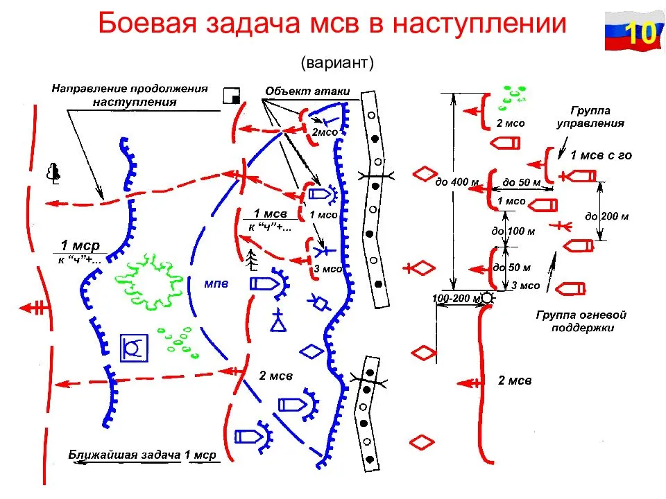
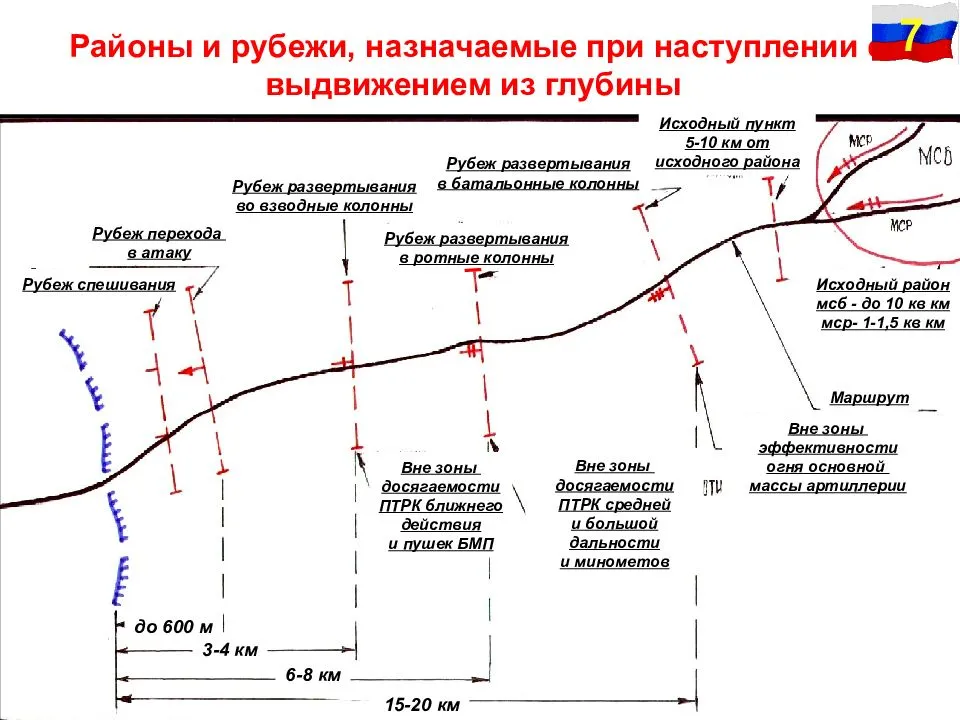
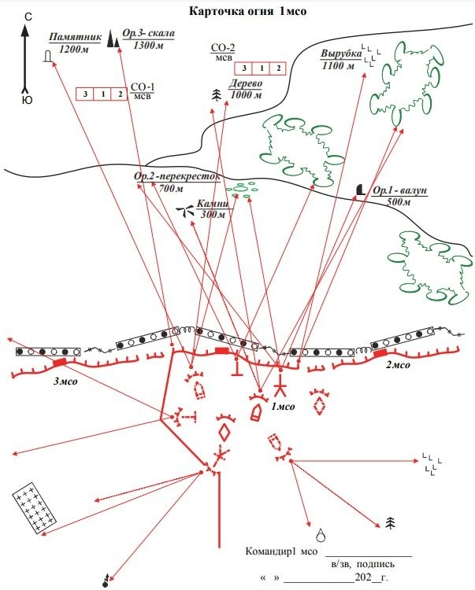
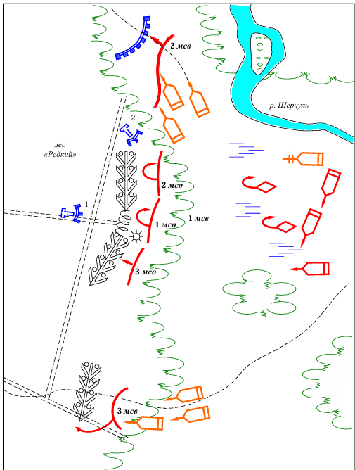
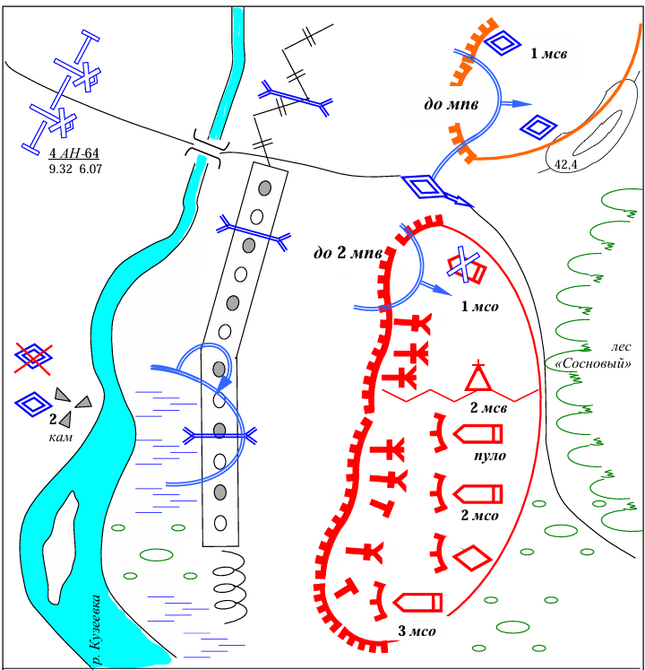

# Урок 06. Основы работы командира по подготовке боя (часть 2)

**Цель урока:** Изучить алгоритм принятия решения командиром, понять структуру замысла боя и основы оформления боевых документов.

## Принятие решения

**Принятие решения** — это ключевой и самый творческий этап работы командира подразделения при организации боя.  
Оно происходит не спонтанно, а по четкому алгоритму, который позволяет учесть все факторы и выбрать оптимальный способ выполнения задачи.

**Важно:** Решение считается принятым, когда командир утвердил его у старшего начальника (если есть возможность) и довел до подчиненных в форме боевого приказа.

Основу любого решения составляет **замысел боя**.  
**Выработка замысла боя** — это этап, на котором рождается основная идея достижения победы. Командир отвечает на вопрос: «Как именно мы выполним задачу, имея текущие ресурсы и обстановку?».

Процесс начинается с момента получения боевой задачи от старшего начальника.  
В зависимости от наличия времени работа может вестись двумя методами:

* Последовательный метод (если времени много) — решение принимается полностью, затем ставятся задачи подчиненным.
* Параллельный метод (при дефиците времени) — командир отдает предварительные распоряжения сразу после уяснения задачи,
  чтобы подразделения и личный состав начали подготовку, пока он вырабатывает детальное решение.

## Этапы принятия решения

Процесс мыслительной работы командира условно делится на три ключевых фазы:

1. Уяснение задачи (Что нужно сделать?)

   Прежде чем думать «как», командир должен четко понять «что» от него требуется. На этом этапе он определяет:

   * **Цель** предстоящих действий (чего нужно достичь).
   * **Задачу, место и роль своего подразделения** в общем замысле старшего начальника.
   * **Задачи соседей** (кто прикрывает фланги, с кем взаимодействовать).
   * **Срок готовности** к выполнению задачи.

2. Оценка обстановки (Каковы условия?)

   Командир анализирует факторы, влияющие на бой. Обычно используется мнемоническое правило анализа по группам:

   * **Противник**: состав, положение, возможный характер действий, сильные и слабые места.
   * **Свои войска**: укомплектованность, боеспособность, наличие боеприпасов и топлива.
   * **Соседи и взаимодействующие**: кто поможет огнем или маневром.
   * **Местность**: проходимость, защитные свойства, условия наблюдения и маскировки.
   * **Прочие условия**: погода, время суток, радиационная обстановка.

3. Выработка замысла боя (Как будем побеждать?)

   Это ядро решения, его главная идея.  
   Замысел рождается в голове командира часто одновременно с оценкой обстановки.  
   Согласно боевым уставам и учебной литературе, замысел боя включает:

   1. **Направление сосредоточения основных усилий**

      Это выбор участка местности или направления, где командир планирует использовать свои главные силы и средства для достижения решающего успеха - «точка приложения силы».

       * **В наступлении**: это направление главного удара, где создается многократное превосходство над противником для прорыва его обороны.
       * **В обороне**: это ключевой участок местности (высота, перекресток, мост), удержание которого лишает противника инициативы и не дает ему развить успех.

   2. **Способы разгрома противника**

      Здесь командир определяет конкретную тактику уничтожения врага. Это не просто «стрелять во врага», а продуманная последовательность действий (сценарий). В этот пункт входят:

       * **Порядок огневого поражения**: кого уничтожаем в первую очередь (артиллерию, пункты управления, танки), кого во вторую.
        Например, «сначала подавить ПТУРы противника огнем артиллерии, затем уничтожить пехоту огнем БМП».
       * **Манёвр**: какой вид маневра применить — охват (атака во фланг), обход (выход в глубокий тыл), или фронтальный удар (прорыв в лоб).
       * **Последовательность уничтожения**: разгром противника по частям или одновременное уничтожение всей группировки.
       * **Мероприятия по обману**: демонстративные действия, создание ложных позиций.

   3. **Боевой порядок**

      Это схема построения подразделений перед боем, которая позволяет реализовать задуманное (см. п. 1 и 2).
      Командир определяет состав боевых групп, подразделений и как расположить их на местности.

**Вырабатывая замысел при наступлении**, командир по этапам выполнения полученной задачи определяет:

* порядок и способ перехода в атаку;
* порядок и способы действий:
  * какого противника, где, во взаимодействии с кем, какими средствами и как уничтожить,
  * при переходе в атаку,
  * при сближении с противником,
  * при преодолении инженерных заграждений (естественных препятствий),
  * при овладении объектом атаки,
  * при развитии наступления в глубине;
* построение боевого порядка;
* обеспечение скрытности при подготовке и выполнении полученной задачи.

**Вырабатывая замысел при обороне**, командир определяет:

* порядок и способы действий:
  * какому противнику, где и какими средствами нанести поражение при его выдвижении и развертывании,
  * при отражении атаки,
  * при уничтожении вклинившегося противника, в том числе ворвавшегося в траншею и в ход сообщения;
* построение боевого порядка;
* обеспечение скрытности при подготовке и выполнении полученной задачи.

Завершает **принятие решения** следующим:

* определяет задачи элементам боевого порядка (подразделениям, огневым средствам, личному составу);
* определяет основные вопросы взаимодействия, всестороннего обеспечения и управления.

В задачах **элементам боевого порядка при наступлении** (подразделениям, личному составу и огневым средствам) командир определяет:

* состав боевых групп, их места в общем боевом порядке;
* порядок выдвижения к рубежу перехода в атаку (занятия исходного положения), сближения с противником и атаки;
* объекты атаки, цели, на уничтожение которых необходимо сосредоточить усилия, направления действий;
* во взаимодействии с кем выполняется задача и другие вопросы.

В задачах **элементам боевого порядка при обороне** командир определяет:

* состав боевых групп, их места в общем боевом порядке и выполняемые по этапам действий задачи;
* в задачах определяются:
  * места позиций (боевых позиций отделений, огневых позиций штатных и приданных огневых средств);
  * задачи по отражению наступления и уничтожению вклинившегося противника (какого противника, где, когда, во взаимодействии с кем и как уничтожить).

В основных **вопросах взаимодействия** командир определяет задачи, по которым необходимо согласовать усилия элементов боевого порядка (подразделений, огневых средств, личного состава):

* между собой,
* с силами и средствами старшего начальника, выполняющими задачи в интересах подразделения.

В основных **вопросах всестороннего обеспечения** командир определяет:

* основные мероприятия боевого обеспечения,
* порядок выполнения мероприятий морально-психологического, технического и тылового обеспечения,
* последовательность и сроки их выполнения,
* привлекаемые силы и средства.

В основных **вопросах управления** командир определяет:

* место и время развертывания командно-наблюдательного пункта (свое место) в боевом порядке;
* порядок уточнения боевых задач;
* использования средств связи при подготовке и в ходе боя;
* порядок доведения до подчиненных сигналов управления, взаимодействия, оповещения и передачи управления.

## Завершение и оформление решения

После того как замысел сформирован, командир завершает принятие решения. Полное решение включает в себя:

* Замысел боя.
* Боевые задачи конкретным элементам боевого порядка (подчиненным подразделениям и огневым средствам).
* Основы взаимодействия (сигналы, порядок действий при смене обстановки).
* Организацию управления (где находится КНП, частоты связи).
* Основы всестороннего обеспечения (разведка, охранение, тыловое обеспечение).

### В наступлении

Решение командир оформляет на **рабочей карте**, на которой отображается:

* начертание траншей и ходов сообщения противника,
* расположение его огневых средств перед фронтом наступления и на флангах на глубину боевой задачи,
* возможный характер действий противника,
* исходная позиция подразделения,
* объект атаки и цели, на уничтожение которых необходимо сосредоточить усилия,
* цели, поражаемые средствами старшего начальника,
* место и номера проходов в минно-взрывных заграждениях.

При наступлении с выдвижением из глубины, кроме того, необходимо указать:

* маршрут выдвижения,
* исходный пункт,
* рубеж (пункт) развёртывания,
* рубеж перехода в атаку
* рубеж спешивания при атаке в пешем порядке и другие данные.

### В обороне

Решение командир оформляет на **карточке огня**, на которой отображается:

* ориентиры, их номера, наименование и расстояния до них;
* положение противника;
* позицию подразделения;
* полосу огня и дополнительный сектор обстрела;
* основные и запасные огневые позиции БМП (БТР), пулемётов, гранатомётов и установок противотанковых управляемых ракет,
* основные и дополнительные секторы обстрела с каждой позиции;
* позиции соседей и границы их полос огня на флангах подразделения;
* участки сосредоточенного огня;
* заграждения, прикрываемые огнём.

## Практические примеры

### Взвод в наступлении

**Задача**:

* 1-й мсв развивает наступление в глубине обороны противника, и в пешем порядке вышел к опушке леса «Редкий».
* Командир взвода наблюдает: в боевом порядке 1 мсо два взрыва; справа из глубины леса по 2 мсо открыл огонь пулемет противника, отделение залегло и ведёт огонь. БМП обходят болото слева.
* Командир 1 мсо доложил, что встретил минированный завал, на котором при взрыве ранено три человека. Слева в лесу слышны сильная автоматическая стрельба и разрывы гранат.
* Командир 1 мсв по радио слышит доклад командира 3 мсв командиру роты о том, что встретил завал, обходит его слева по просеке.

**Ожидаемый доклад командира 1 мсв**:

**Оценив** сложившуюся обстановку, сделал следующее заключение.

1. 1-му мсв предстоят действия на лесисто-болотистой местности в пешем порядке.
2. Применение БМП и танков для огневой поддержки наступления ограничено.
3. Местность позволяет противнику осуществлять манёвр и внезапно открывать огонь с разных направлений.
4. Управление мотострелковыми отделениями при неполной и противоречивой информации, а также взаимодействии с соседями будет затруднено.
5. На 10.10 сложилась следующая обстановка:
   * первое и второе мсо на пути выдвижения встретили минированный завал, прикрытый огнём пулемётов;
   * при попытке преодоления заграждений в 1 мсо ранены 3 человека;
   * третье мсо обходит завал и атакует противника с левого фланга;
   * БМП и танки после выхода из заболоченного участка местности поддержать огнём наступление взвода в лесном массиве не могут (ввиду неопределенности обстановки).

**Вывод**: Успешное развитие наступления роты возможно при обходе 1 мсв опорного пункта и атаке противника с левого фланга.

**Решил**:

1. Обойти минированный завал слева, уничтожить противника в опорном пункте и развивать наступление в направлении оз. Лебяжье.
2. Определить задачи отделениям:
   * третьему мсо огнём с левого фланга уничтожить пулемет № 1 и живую силу противника, прикрывающие минированный завал.
    Во взаимодействии с 2 мсо подавить пулемет № 2 и обеспечить дальнейшее продвижение 2 мсо;
   * первому мсо обойти завал слева, блокировать опорный пункт с сев. зап., не допуская подхода дополнительных сил противника.
3. БМП и экипажу танка подрывом фугаса и имеющимися на машинах приспособлениями для разминирования проделать проход к просеке.
4. Определить направление выдвижения взвода: лесная просека (А – 2800) – оз. Лебяжье. В ходе выдвижения обеспечить походное охранение колонны взвода.
5. Доложить командиру мср о своих действиях, уяснить порядок взаимодействия со 2 и 3 мсв в ходе выдвижения и преследования противника.
6. Санинструктору оказать неотложную помощь раненым и подготовить их (в случае необходимости) к отправке в медицинскую часть.

### Взвод в обороне

**Задача**:

* 2-ой мсв с танком обороняет опорный пункт. Противник атакует в восточном направлении.
* До двух мпо с танком при поддержке огня БТР после удара вертолетов огневой поддержки овладели позицией 1 мсо и продолжают обход опорного пункта взвода справа.
* Перед позицией 2 мсо остановлена и залегла группа мотопехоты, которая во взаимодействии с танком ведёт огонь.
* Командир взвода наблюдает разрывы снарядов у БМП 1 мсо, которая прекратила огонь.
* По радио командир взвода слышит доклад соседа справа о вклинении двух танков и до мпв на левом фланге опорного пункта 1 мсв.

**Ожидаемый доклад командира 2 мсв**:

**Оценив** сложившуюся обстановку, сделал следующее заключение:

1. Против ник осуществляет подготовку прорыва обороны и выдвижение основных сил в восточном направлении.
2. С этой целью нанесены удары вертолетами огневой поддержки, мотопехотными и танковыми подразделениями по опорным пунктам 1 и 2 мсв.
3. Возникла угроза обхода опорного пункта 2 мсв, уничтожения его сил и средств.

В связи с возникшей угрозой захвата опорного пункта противником, **решил**:

1. Личному составу 3 мсо оставить занимаемую позицию, скрытно выдвинуться вдоль западной опушки леса «Сосновый», занять тыльную траншею опорного пункта.
   БМП использовать как «кочующее» огневое средство. Обходящие опорный пункт мотопехоту и танк уничтожить перекрестным огнём 2-го, 3 мсо и оставшегося в живых личного состава 1 мсо.
2. Танку выдвинуться в стык опорных пунктов 1 и 2 мсв, оборудовать огневую засаду на западной окраине леса «Сосновый». Бронированную технику уничтожить с близкого расстояния прямой наводкой.
3. 2 мсо сдерживать продвижение группы мотопехоты и танка. В случае необходимости огнём из пулемётов прикрыть сектор:
   * каменный карьер,
   * южная оконечность острова (участок обороны 3 мсо, совершившего манёвр на запасную позицию).
4. Выяснить потери в 1 мсо и степень поражения БМП. Поставить задачи уцелевшему личному составу отделения, оказать неотложную помощь раненым.
5. О сложившейся обстановке и принятом решении доложить командиру мср.
